## hw1

문제 설명

Text input 파일로부터 데이터를 하나씩(순차적으로) 읽어 들일때마다, 정렬/추가 하기.

그리고 정렬된 데이터에 대해 검색을 하여 몇번째 index에 위치하는지 확인하기.

예시)

```c
 74 added at 0
 21 added at 0
 42 added at 1
 94 added at 3
 13 added at 0
 24 added at 2
 80 added at 5
 45 added at 4
 75 added at 6
 37 added at 3
 96 added at 10
 28 added at 3
 26 added at 3
 99 added at 13
 97 added at 13
 36 added at 5
 93 added at 12
 18 added at 1
```

아래 함수들은 직접 작성한 코드이고, 그 외에는 교수님께 제공받은 template들입니다.

* int add_value_for_binsearch( int A[], int loc, int val ) 

```c
int add_value_for_binsearch( int A[], int loc, int val ) 
  // assumption: A[0]~A[loc-1] - sorted values
  // find the location of val in A including A[loc]
  // and re-order all the other values as well
{
	int i, j;//루프문 제어용 변수

	if (loc == 0)A[0] = val;
	else {
		for (i = 0; i < loc; i++) {//값을 비교하기 위한 반복문
			if (A[i] > val) {//배열에 넣으려는 데이터보다 더 큰 배열 요소를 찾으면
				for (j = loc - 1; j >= i; j--)A[j+1] = A[j];
				//데이터가 이미 들어있는 배열의 인덱스 끝에서부터 넣으려는 데이터가 들어갈
				//인덱스 순까지 오른쪽으로 다 차례차례씩 밀기
				break;
			}
		}
		A[i] = val;
		return i;
	}
	return 0;
}
```

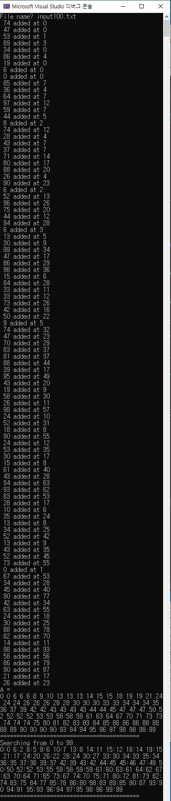

***

## hw2

문제 설명

1. Insertion sort를 linked list를 이용하여 구현.

2. Merge sort를 array를 이용하여 구현.

3. Merge sort를 linked list를 이용하여 구현.

아래 함수들은 직접 작성한 코드이고, 그 외에는 교수님께 제공받은 template들입니다.

arraysort_template.c

* void merge_sort( long A[], long Tmp[], int left, int right )

***

heavy_arraysort_v2_template.c

* void merge_sort_heavy( struct HLoad A[], struct HLoad Tmp[], int left, int right )

***

heavy_listsort_template.c

* struct LHNode *list_insertion_sort ( struct LHNode *head )

* struct LHNode *list_array_merge_sort( struct LHNode **head_array, int N )

* struct LHNode* merget_list(struct LHNode* left, struct LHNode* right)

listsort_template.c

* struct LNode* list_insertion_sort(struct LNode* head)

* struct LNode* list_array_merge_sort(struct LNode** head_array, int N)

* struct LNode* merget_list(struct LNode* left, struct LNode* right)

***

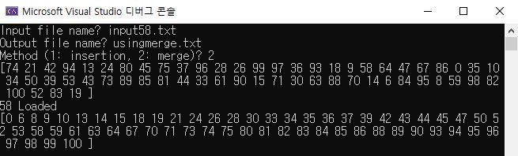

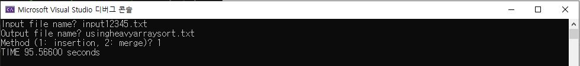

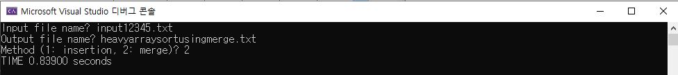

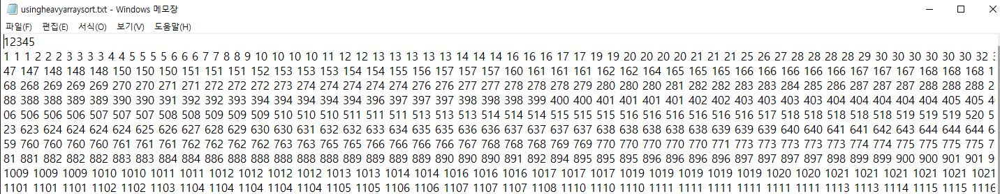

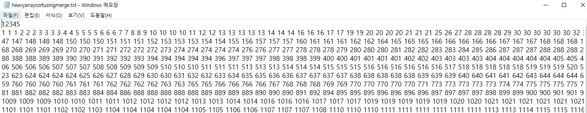

***

## hw3

문제 설명

Binary Tree를 구현한 후, 과제에서 요구하는 형식으로 tree를 display합니다.

아래 함수들을 직접 작성한 코드이고, 그 외에는 교수님께 제공받은 templete들입니다.

```c
struct BTNode* insert_to_BST_leaf(struct BTNode* bst, struct BTNode* newPtr)

struct BTNode* generate_BST_by_insertion(struct BTNode* lhbt)

int print_LHBT(FILE* fp, struct BTNode* lhbt)

int print_BST_sortedorder(FILE* fp, struct BTNode* bst, int level)

int print_BST_right_center_left(FILE* fp, struct BTNode* bst, int level)

int print_BST_1(FILE* fp, struct BTNode* bst, int level)

int print_BST_2(FILE* fp, struct BTNode* bst, int level, queue *q1)

struct BTNode* same_check(queue *q1, struct BTNode* bst)

queue* enqueue(queue* q1, struct BTNode *bst, int level)

queue* end_dequeue(queue* q1)

int check_slash(queue *q1, int level)

struct BTNode* BST_to_completeBST(struct BTNode* bst, int numNodes, struct BTNode** array_str)

struct BTNode* split_index(int left, int right, struct BTNode** array_str)

struct BTNode* make_sorted_array(struct BTNode* bst, struct BTNode** array_str, int* key_index)

double logB(double x, double base) 

struct BTNode* generate_BST_quicksort_basic(struct BTNode* lhbt)

struct BTNode* partition_q(struct BTNode** left, struct BTNode** right, struct BTNode *lhbt)

void add_to_tail(struct BTNode** head, struct BTNode** tail, struct BTNode* element)
```

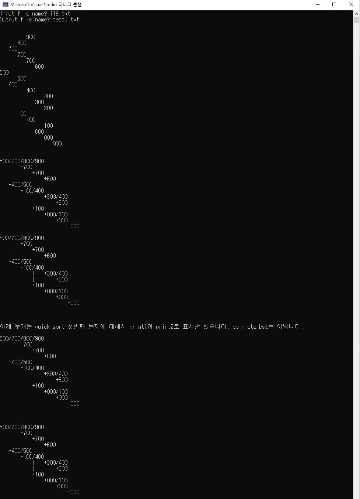

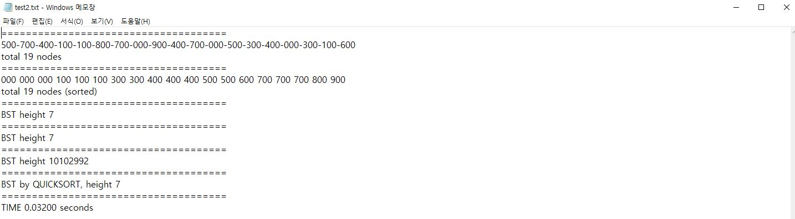

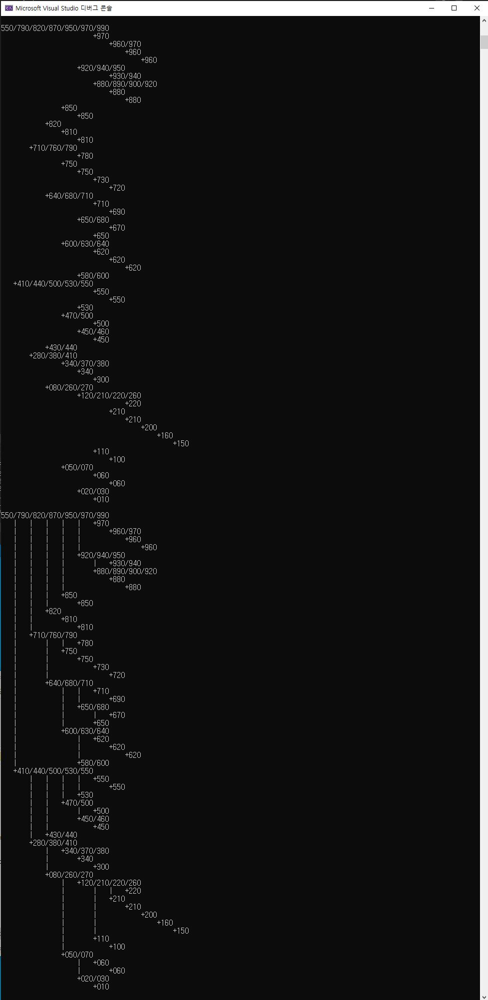

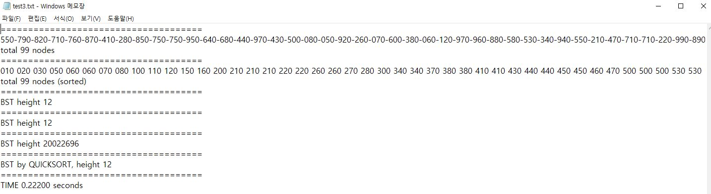

***

## hw4

DP

1. Knapsack 문제

2. Knapsack with one item split 문제

하나의 물건(item)을 한번만 반으로 나누어서 배낭에 넣을 수 있는 경우입니다.

3. Knapsack with one duplicate item 문제

하나의 물건(item)을 2번 들고 갈 수 있는 경우입니다.

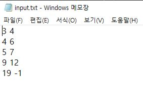

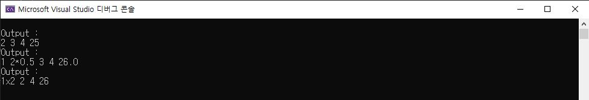

***

## hw5

문제 설명

제한된 경로의 길이로 최대한 많은 점 방문하기.

100x100 2차원 좌표평면에서 각각 고정된 연로 200, 400, 600, 800, 1000, 1500을 가지고 있을때
(0,0)도시에서 시작하여 마지막 도시(100, 100)까지 여행을 할때, 중간에 위치한 도시들을 최대한 많이 방문하는 문제입니다.

### 제약조건

* x축으로 전진만 가능

* x축 좌표가 같은 도시가 있을 수 있음

* x축과 y축 좌표가 둘다 같은 도시가 있을 수 있음

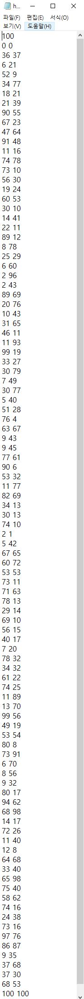

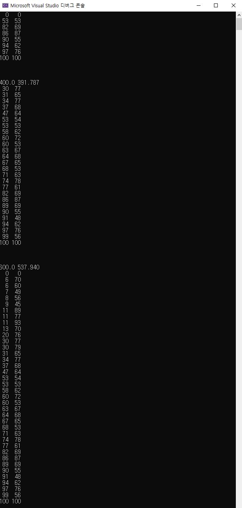

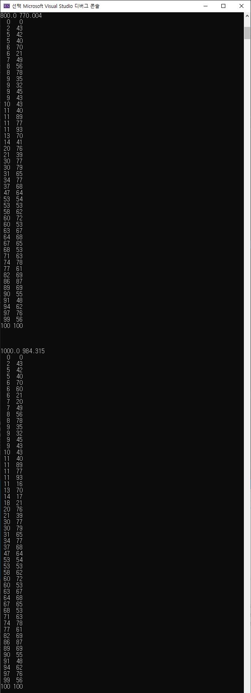

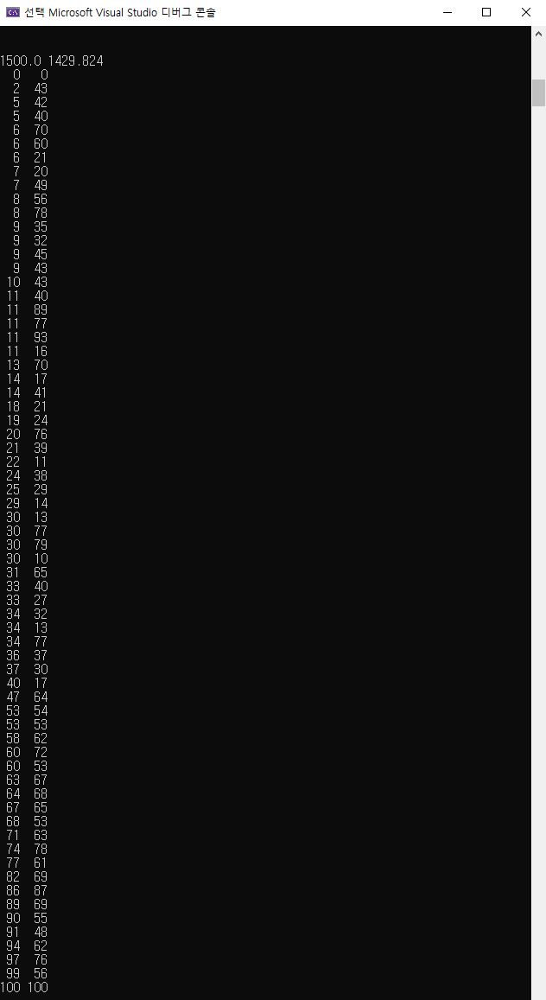


### hw1 ~ hw3의 경우, 과제가 주어질때 교수님께 제공받은 templete을 채워넣는 형식입니다. 따라서 tmeplete을 채워 넣는 일부만 직접 작성한 코드입니다.

### hw4, hw5의 경우 모든 소스 코드는 직접 작성하였습니다.