# 개요

* 한 학기 동안 배운 내용을 바탕으로 만든 project 입니다.

* 식단을 랜덤으로 짜주는 프로그램입니다.

* 식단을 랜덤으로 짤 때, 필요한 음식들의 이름을 가지고 밥, 국, 면, 빵, 찌개등등의 카테고리로 분류한다음 중복된 음식이 없도록 식단을 생성합니다.

* 또한 하루전에 나왔던 음식이 다음날에는 나오지 않도록 하여 식단이 물리는 상황을 방지하였습니다.

* 새로운 음식을 추가할 때, 사용자가 음식 카테고리를 설정하지 않아도 문자열 패턴을 이용해 자동으로 분류하도록 합니다.

* gotoxy()함수를 이용해 캘린더 형식으로 식단을 넘겨 볼 수 있습니다.

* 식단 데이터들은 구조체이며, 전체 자료 구조는 링크드 리스트 형태 입니다.

***

한 학기 교육과정에 대한 모든 내용이 들어가 있습니다.

1. 변수와 데이터 타입(char, int)

2. 분기문(if, switch-case)

3. 반복문(for, while)

4. 배열(char [])과 포인터

5. 함수, 함수인자

6. 구조체(이 프로젝트에서는 주로 구조체 포인터로 다룹니다.)

7. 동적할당

8. 파일 쓰기, 읽기와 같은 파일 처리

9. advance 주제(Linked list, gotoxy(), 검색)

***

## 아이디어

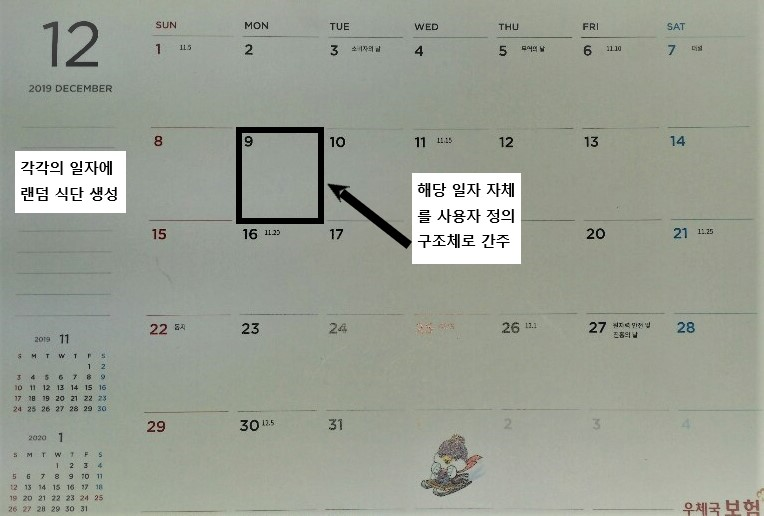

***

# 소스코드

## 1. main_module.c

프로그램의 메인 로직을 중심으로 코딩을 하였습니다. 메인 로직은 사용자로부터 키보드 입력을 받고 대응하는 서브 루틴 함수들을 출력하는 형태입니다.

```c
void main() {
	int i, index_right = 0, index_left;//index는 cal_meal이 어디를 표현해야 할지 알려줄 위치
	int keyboard_value = 0, not_draw_condition;
	char tmp_foodname[16];
	char saved_file_name[21], saved_food_file_name[21];
	int std_weight, work;

	
	system("mode con:cols=143 lines=50");
	system("title 식단표");

	NODE *food, *bob, *gook, *banchan, *jjige, *bread_meal, *noodle;
	FILE *fp , *file_food_name;

	struct meal *cal_meal = (struct meal *)malloc(sizeof(struct meal) * 365);
	
	srand((unsigned int)time(NULL));

	food = NULL;
	bob = NULL;
	gook = NULL;
	banchan = NULL;
	jjige = NULL;
	bread_meal = NULL;
	noodle = NULL;
```

main함수에서 사용할 여러 제어 변수와 식단 데이터를 저장할 변수들이 선언되어 있습니다.


system() api함수를 통해 command window창을 143 X 50의 크기로 지정하고 창의 제목은 title 식단표로 하였습니다.


1년 단위로 식단을 생성하므로, 하루에 들어가는 식단 데이터를 저장할 사용자 정의 type 구조체 meal을 동적 메모리 할당으로 365개를 할당했습니다.


프로그램을 새로 시작할때 마다, 식단을 랜덤하게 형성해야 하므로 rand함수의 시드를 초기화하는 srand()함수를 콜하였습니다.
<br>
<br>
<br>

```c
readFrFile("menu.txt", &food, &bob, &gook, &banchan, &jjige, &bread_meal, &noodle);
	
	file_food_name = fopen("recently_food.bin", "rb");
	fp = fopen("recently.bin", "rb");//이전에 프로그램을 실행 시켰으면 
		//그 때 종료하기 직전에 만들어놓았던 식단을 불러 옵니다.

	if (fp && file_food_name) {//이전에 프로그램을 실행시켰다면...
		readFrBinFile("recently.bin", cal_meal, 2);
		readFrBinFile("recently_food.bin", &food, 1);
		distributeFood(food, &bob, &gook, &banchan, &jjige, &bread_meal, &noodle);
		
		
		system("cls");
		drawTable(2, 2);
		drawData(cal_meal, &index_right, &index_left);
		not_draw_condition = 0;
		
	}
	else {
		not_draw_condition = 1;
	}
```
menu.txt 파일을 읽어 들이고, 문자열내에 들어있는 특정 문자 패턴에 따라 밥, 국, 찌개, 반찬, 면을 분리하여 구조체 데이터에 저장하는 readFrFile()함수를 호출합니다.


recently_food.bin 파일과 recently.bin파일은 최근에 프로그램을 실행시켰다면, 최근에 저장한 음식 데이터와 식단 데이터를 불러오게 됩니다.


<br>
<br>
<br>

```c
	while(1){
		if (not_draw_condition == 1) {
			system("mode con:cols=142 lines=15");
			drawSquare(2, 2);
			gotoxy(1, 3);
			printf("처음이신가요?");
			gotoxy(1, 4);
			printf("새로운 식단을 짜거나 자신의 체중에 맞는 권장 섭취 칼로리 식단을 짤 수 있습니다!");
			gotoxy(1, 5);
			printf("기존에 있는 식단을 불러오시려면 F4키, 새로운 식단을 짜시려면 F1 키를, 저칼로리 식단을 짜시려면 F2키를 눌러주세요^^7");

		}
		if (keyboard_value == 8 && not_draw_condition == 0) {
			system("mode con:cols=143 lines=50");
			index_right = 0;
			drawTable(2, 2);
			drawData(cal_meal, &index_right, &index_left);
		}

	
		keyboard_value = getch();
		
	
	
		
		if (keyboard_value == 224 ) {//화살표 키 누른 경우
			keyboard_value = getch();
			system("mode con:cols=143 lines=50");
			if (not_draw_condition == 1)continue;//표현하고자 할 데이터가 없으면 화살표 입력을 받아도 무시하도록 설정
			switch (keyboard_value) {
			case 77:
				system("cls");
				drawTable(2, 2);
				drawData(cal_meal, &index_right, &index_left);
				//오른쪽
				break;
			case 75:
				system("cls");
				drawTable(2, 2);
				drawData_left(cal_meal, &index_right, &index_left);
				//왼쪽
				break;
			default: continue;

			}
		}

```
프로그램이 돌아가는 주요 부분입니다.

전체 로직은 특정 종료조건을 만족하기 전까지는 무한루프를 돌면서 사용자의 입력을 받습니다.

not_draw_condition이라는 flag 변수값을 통해서 사용자가 처음으로 프로그램을 실행했다면 recently.bin 파일이 없으므로 도움말을 화면에 표시해줍니다.

```c
if (keyboard_value == 8 && not_draw_condition == 0)
```
백스페이스 키를 누르고, not_draw_condition 이라면

화면에 나타내는 전처리 조건 및 과정을 끝내고나면, 사용자로부터 화살표 키 값을 입력받습니다.
만약, 식단값을 생성하지 않았거나, 최근에 프로그램을 실행시킨적이 없다면 continue를 수행하여 화살표 키보드를 눌러도 계속 도움말 초기화면만 표시하도록 하였습니다.

```c
if (not_draw_condition == 1)continue;
```

반대로 표시할 식단 데이터가 있다면 drawTable()함수를 호출하여 캘린더를 커맨드 윈도우에 표시하고, drawData()함수를 통해 식단 데이터들을 알맞게 표시해줍니다.
1년 식단만 표시되야 하므로, 해당년도 1월에서 왼쪽키를 누르면 해당년도 12월로 돌아가야 하기 때문에 index_left와 index_right변수를 사용합니다.

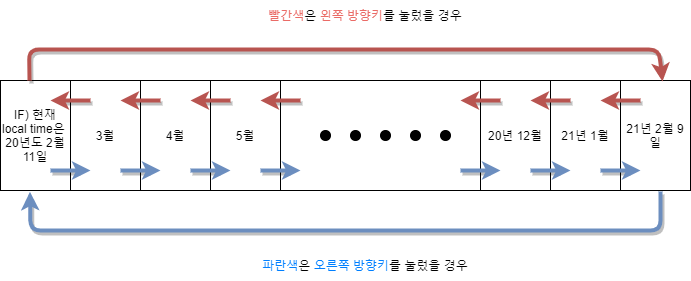

여기서 주의할 점이 getch()함수를 호출하게 되면 화살표의 경우 버퍼에는 224아스키코드값이 공통으로 저장됩니다. 따라서 getch() 리턴 값이 244라면 getch() 함수를 
한번 더 호출하여 해당 화살표키가 오른쪽인지, 왼쪽인지 구분하게 됩니다.


```c
else {//여긴 메뉴 버튼
			
			switch (keyboard_value) {
			case 59://랜덤 식단 짜기
				not_draw_condition = 0;
				system("mode con:cols=143 lines=50");
				free(cal_meal);
				cal_meal = (struct meal *)malloc(sizeof(struct meal) * 365);
				input_data(cal_meal, bob, gook, jjige, banchan, bread_meal, noodle);
				drawTable(2, 2);
				index_right = 0;
				drawData(cal_meal, &index_right, &index_left);
				break;

			case 60://건강식 짜기
				not_draw_condition = 0;
				
				free(cal_meal);
				cal_meal = (struct meal *)malloc(sizeof(struct meal) * 365);

				system("mode con:cols=142 lines=15");
				drawSquare(2, 2);
				gotoxy(1, 3);
				printf("성인 하루 일일 권장 섭취 칼로리를 기준으로 식단을 만듭니다.");
				gotoxy(1, 4);
				printf("표준 체중과 작업량을 입력하시면 해당 칼로리미만의 식단을 보여드립니다.");
				gotoxy(1, 5);
				printf("표준 체중을 입력해주세요 : ");
				scanf("%d", &std_weight);
				system("cls");

				system("mode con:cols=142 lines=15");
				drawSquare(2, 2);
				gotoxy(1, 3);
				printf("하루 신체 활동량(작업량을 적어주세요).");
				gotoxy(1, 4);
				printf("평소 운동량이 적은사람(30~32)");
				gotoxy(1, 5);
				printf("하루 한 두시간 운동을 하는 사람(33~36)");
				gotoxy(1, 6);
				printf("힘든 육체 노동을 하는 사람(37~42)");
				gotoxy(1, 7);
				printf("전문적인 운동선수는(43~)");
				gotoxy(1, 8);
				printf("하루 활동량은 ? : ");
				scanf("%d", &work);


				system("mode con:cols=143 lines=50");
				input_healthy_data((std_weight*work)/2, cal_meal, bob, gook, jjige, banchan, bread_meal, noodle);
				drawTable(2, 2);
				index_right = 0;
				drawData(cal_meal, &index_right, &index_left);
				break;
				
```
여기서부터는 키보드 방향키가 아닌 아래와 같은 기능을 하는 키보드 버튼을 눌렀을 경우에 대해 switch-case문으로 처리하는 부분입니다.

1. F1 : 랜덤 식단 짜기

2. F2 : 저칼로리 식단

3. F3 : 음식 추가/삭제

4. F4 : 저장/불러오기

5. F5 : 종료하기


아스키 코드값이 59인 F1키를 눌렀을 경우, 랜덤 식단을 짜게 됩니다.
동적할당을 통해 365개의 식단을 저장할 사용자 정의 구조체 공간을 할당하였고, 실질적으로 랜덤 식단을 짜주는 input_data()함수를 호출합니다.

아스키 코드값이 60인 F2키를 눌렀을 경우, 성인 하루 일일 권장 섭취 칼로리를 기준으로 건강식단을 만듭니다.
사용자로부터 표준 체중, 일일 활동량을 입력 받아 계산한 후 건강 식단을 만드는 input_healthy_data()함수를 호출하여 식단 데이터들을 만듭니다.
마찬가지로 여기에서도 동적할당으로 365개의 식단 데이터 크기를 배정받습니다.
<br>
<br>
<br>


```c
			case 61://음식 검색, 추가및 삭제
				while (1) {

					
					system("mode con:cols=142 lines=15");
					drawSquare(2, 2);
					gotoxy(1, 3);
					printf("음식을 검색하시려면 1을");
					gotoxy(1, 4);
					printf("음식을 삭제하시려면 2를");
					gotoxy(1, 5);
					printf("음식을 추가하시려면 3을 눌러주세요^^7");

					gotoxy(1, 8);
					printf("이전 메뉴로 가시려면 백스페이스(뒤로가기)를 눌러주세요.");


					keyboard_value = getch();
					system("cls");
					drawSquare(2, 2);
					if (keyboard_value == 8)break;//메뉴 검색/추가/삭제 메뉴 빠져나가기
					switch (keyboard_value) {
					case 49: {//1번을 누른 경우

						gotoxy(1, 3);
						printf("찾고자 하는 음식의 이름 : ");
						scanf("%s", tmp_foodname);
						find_food_propertise(food, tmp_foodname);
					}
							 break;
					case 50: {//2번을 누른 경우

						gotoxy(1, 3);
						printf("지우고자 하는 음식의 이름 : ");
						scanf("%s", tmp_foodname);
						i = remover_FoodName(&food, tmp_foodname);
						//i는 제어 변수입니다.
						//성공적으로 데이터를 지웠으면1을, 아니면 0값을 가집니다.
						if (i == 1) {
							remover_LinkedList(&bob);
							remover_LinkedList(&banchan);
							remover_LinkedList(&gook);
							remover_LinkedList(&jjige);
							remover_LinkedList(&noodle);
							remover_LinkedList(&bread_meal);

							distributeFood(food, &bob, &gook, &banchan, &jjige, &bread_meal, &noodle);

							gotoxy(1, 4);
							printf("해당 음식을 목록에서 지웠습니다!");
							gotoxy(1, 5);
							printf("3초후 음식 추가/검색/삭제 화면으로 돌아갑니다. \n");
							Sleep(1000);
							gotoxy(1, 5);
							printf("2");
							Sleep(1000);
							gotoxy(1, 5);
							printf("1");
							Sleep(1000);
						}
					}
							 break;
					case 51: {//3번을 누른 경우

						gotoxy(1, 3);
						printf("추가할 음식의 이름, 가격, 칼로리순으로 입력해주세요.\n");
						gotoxy(1, 4);
						storeData(&food, &bob, &gook, &jjige, &banchan, &bread_meal, &noodle);
					}
							 break;		
					default:;
					}
```
아스키 코드값이 61인 F3키를 눌렀을 경우, 음식에 대한 검색/추가/삭제 삭제를 하는 분기문 입니다.
좀 더 세분화된 제어를 위해 사용자로부터 한번더 입력을 받습니다.

검색의 경우 find_food_propertise()함수를 호출하는데, 내부적으로는 strcmp()문자열 비교함수를 이용하여 찾습니다.
```c
if (strcmp(tmp->food_name, target) == 0)
```
<br>
<br>

음식 데이터의 삭제는 remover_FoodName()을 호출합니다. remover_FoodName()함수에서 성공적으로 해당 데이터를 지웠으면, 링크드 리스트로
구현된 음식 카테고리에서도 해당 음식 데이터를 지워야 합니다.

음식 데이터가 지워지면, 링크드 리스트로 구현되어 있는 음식 카테고리에 대한 수정이 필요합니다.
여기서 저는 링크드 리스트를 구성하는 모든 노드들을 free()를 통해 제거하고 distributeFood()함수를 다시 호출하여 새롭게 링크드 리스트를 구현하도록 해놨습니다.

```c
			case 62://저장하기/ 불러오기

				system("cls");
				system("mode con:cols=142 lines=15");
				.
				.
				.
					printf("저장하실 파일의 이름을 적어주세요\n");
					gotoxy(1, 4);
					scanf("%s", saved_file_name);
					strcpy(saved_food_file_name, saved_file_name);
					fflush(stdin);
					strcat(saved_file_name, ".bin");
					strcat(saved_food_file_name, "_food.bin");

					writeAtFile(saved_file_name, cal_meal, 2);
					writeAtFile(saved_food_file_name, food, 1);

					gotoxy(1, 5);
					printf("저장했습니다!");
					gotoxy(1, 6);
					printf("3초후 메인화면으로 돌아갑니다. \n");
					Sleep(1000);
					gotoxy(1, 6);
					printf("2");
					Sleep(1000);
					gotoxy(1, 6);
					printf("1");
					Sleep(1000);

					system("mode con:cols=143 lines=50");
					drawTable(2, 2);
					index_right = 0;
					drawData(cal_meal, &index_right, &index_left);

					break;

				.
				.
				.
				gotoxy(1, 1);
				printf("프로그램을 종료합니다.");
				Sleep(1500);
				exit(0);
				break;
			default: continue;
			}
		}		
	} 	
}
```
다음으로 저장하기와 불러오기에 대한 제어입니다.
이전에 음식 추가/검색/삭제에서의 제어 로직과 비슷해 주목할 부분만 가져왔습니다.

식단을 저장하게 되면 binary파일로 저장하게 됩니다. binary 확장자 bin으로 지정해주기 위해 strcat()함수를 이용하였고 식단에 대한 데이터와
음식에 대한 데이터들을 bin파일로 writeAtFile()함수를 통해 최종적으로 저장하게 됩니다.

저장이 됬다는것을 시각적으로 알려주기 위해 Sleep()함수를 이용하여 시각적인 효과를 표시해주었습니다.

***

## 2. data.c

메인 메뉴들이 적혀있는 음식 파일 menu.txt를 읽어들이고, 이를 구조체 형식으로 바꿉니다.
구조체 데이터들을 이용하여 랜덤 식단과 건강 식단 생성, 새로운 식단 추가 또는 제거, text와 bin형태의 파일로 저장하는 함수들이 정의되어 있습니다.

여기서 생성된 식단들은 링크드 리스트형식으로 관리됩니다.
즉, 12월달에 생성된 각각의 일별 식단들이 링크드 리스트의 노드에 대응됩니다.

```c
void storeData(struct food_category **food, struct food_category **bob, struct food_category **gook, struct food_category **jjige, struct food_category **banchan, struct food_category **bread_meal, struct food_category **noodle) {
		NODE *tmp, *new_node, *new_node_sub;
		
		new_node = (NODE *)malloc(sizeof(NODE));
		new_node->link = NULL;
		tmp = *food;

		scanf("%s%d%d", new_node->food_name, &(new_node->price), &(new_node->calorie));
		
		if (tmp == NULL) {
			//빈 연결 리스트면 첫 번째 노드를 연결
			*food = new_node;
		}
		else {
			while (tmp->link != NULL) {
				tmp = tmp->link;
			}
			tmp->link = new_node;
		}
			if (strstr(new_node->food_name, "밥") != NULL) {
				tmp = *bob;
				new_node_sub = (NODE *)malloc(sizeof(NODE));
				new_node_sub->link = NULL;
				strcpy(new_node_sub->food_name, new_node->food_name);
				if (tmp == NULL) {
					//빈 연결 리스트면 첫 번째 노드를 연결
					*bob = new_node_sub;
				}
				else {
					while (tmp->link != NULL) {
						tmp = tmp->link;	
					}
					tmp->link = new_node_sub;
				}
			}
			else if (strstr(new_node->food_name, "국수") != NULL) {
				tmp = *noodle;
				new_node_sub = (NODE *)malloc(sizeof(NODE));
				new_node_sub->link = NULL;
				strcpy(new_node_sub->food_name, new_node->food_name);
				.
				.
				.
```
음식 데이터를 메모리상에 추가하고, 카테고리 별로 분류한다음, 링크드리스트로 구현하는 함수입니다.

먼저 빈 링크드 리스트이면, food 구조체에 첫번째 노드를 생성합니다.

빈 링크드 리스트가 아니라면, 분류를 한 다음 맞는 카테고리에 노드를 추가하게 됩니다.
분류 작업은 strstr()함수를 이용하였으며, 각 음식의 특정 문자열 패턴을 찾도록 하였습니다.
예를 들어, 잡곡밥, 현미밥, 율곡밥, 쌃밥등은 모두 밥 이라는 문자열 패턴을 지니고 있으므로 bob 카테고리에 추가하게됩니다.

각각의 카테고리도 링크드 리스트이므로, 새로운 음식을 노드에 추가 하기위해서는 링크드리스트의 마지막 노드까지 검사를 하게 됩니다.
해당 노드의 link멤버 변수가 null이라면, 마지막 노드이므로 새로운 음식데이터를 노드로 이어줍니다.

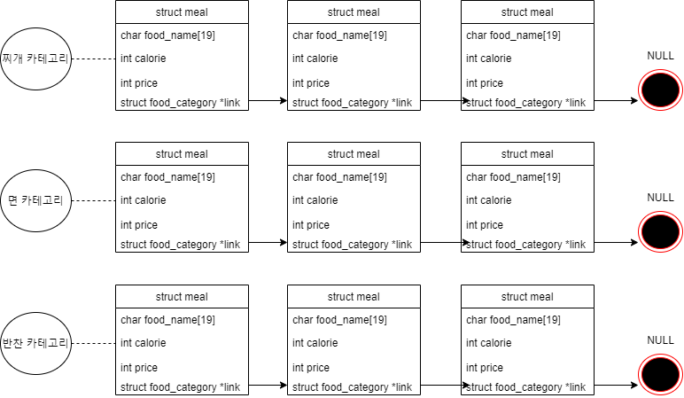
```c
void input_data(struct meal *cal_meal, struct food_category *bob, struct food_category *gook, struct food_category *jjige, struct food_category *banchan, struct food_category *bread_meal, struct food_category *noodle)
{
	int i, j, k;//반복문 제어 변수
	int percentage;//1, 2, 3식에 대하여 각각이 나올 확률
	int tot;//3일 중복에 관한 제어 변수
	int flag, compare_num;//3일 중복에 관한 제어 변수
	
	time_t current;
	struct tm *cal_time;
	current = time(NULL);
	cal_time = localtime(&current);

	for (i = 0; i < 365; i++) {
		(cal_meal + i)->meal_calendary.year = cal_time->tm_year + 1900;
		(cal_meal + i)->meal_calendary.month = cal_time->tm_mon + 1;
		(cal_meal + i)->meal_calendary.day = cal_time->tm_mday;
		(cal_meal + i)->meal_calendary.mday = cal_time->tm_wday;
		current += 60 * 60 * 24;//하루 증가
		cal_time = localtime(&current);

		

	}//날짜 data & 메뉴 개수 입력
	
	//일단 중복 조건 고려하지 않고 메뉴만 넣었을경우
	for (i = 0; i < 365; i++) {

		(cal_meal + i)->total_calories = 0;
		while (1) {
			percentage = rand() % 50;//1식이 20퍼센트 확률로 나오기 하기 위함
			flag = 0;
			if (percentage != 0) {
				(cal_meal + i)->meal_num = rand() % 2 + 2;
				switch ((cal_meal + i)->meal_num) {//3 또는 2식 짜는 부분
				case 3:
					if (rand() % 2 == 0) {
						strcpy((cal_meal + i)->meal_menu[0], (food_name(bob)));
						strcpy((cal_meal + i)->meal_menu[1], (food_name(gook)));
						strcpy((cal_meal + i)->meal_menu[2], (food_name(banchan)));
					}
					else {
						strcpy((cal_meal + i)->meal_menu[0], (food_name(bob)));
						strcpy((cal_meal + i)->meal_menu[1], (food_name(jjige)));
						strcpy((cal_meal + i)->meal_menu[2], (food_name(banchan)));

					}

					break;
				case 2:
					strcpy((cal_meal + i)->meal_menu[0], (food_name(bob)));
					strcpy((cal_meal + i)->meal_menu[1], (food_name(jjige)));


					break;
				default:;
					
				}
			}
			else {//단일식 짜는 부분
				(cal_meal + i)->meal_num = 1;
				if (food_name_number(bread_meal) > 0 && food_name_number(noodle) > 0) {
					switch (rand() % 2 + 1) {
					case 1:strcpy((cal_meal + i)->meal_menu[0], (food_name(noodle)));
						break;
					case 2:strcpy((cal_meal + i)->meal_menu[0], (food_name(bread_meal)));
						break;
					default:;
						
					}
				}
				
			}

			/*********중복 메뉴 체크**********/

			if (i == 0)break;

			//3일전까지 비교
			if (i == 1)compare_num = 2;//둘째날은 첫째날과 비교, 즉 하루만 비교하면됨
			else if (i == 2)compare_num = 1;//따라서 셋째날은 이틀을 비교하면 됨
			else compare_num = 0;//나머지는 3일 식단 중복이 안 나오게

			for (tot = 1; tot <= 3 - compare_num; tot++) {
				
				for (j = 0; j < (cal_meal + i)->meal_num; j++) {
					for (k = 0; k < (cal_meal + i - tot)->meal_num; k++) {
						if (strcmp((cal_meal + i)->meal_menu[j], (cal_meal + i - tot)->meal_menu[k]) == 0)
						{
							flag = 1;//중복이 있음을 알려줄 변수
							break;//중복 발견
						}
					}
					if (flag == 1)break;//중복 발견

				}
				if (flag == 1)break;//결국 중복 발견
				
			}
			if (flag == 0)break;//최종적으로 중복이 없음을 확인
		}
	}
	for (i = 0; i < 365; i++) {
		(cal_meal + i)->x = 2+ 20*(((cal_meal + i)->meal_calendary.day - 1) % 7);//하루 증가할때마다 x좌표값이 증가
		(cal_meal + i)->y = 3 + 9 * (((cal_meal + i)->meal_calendary.day - 1) / 7);	//일주일 지날 때 마다 y좌표값이 하나 증가
	}
}
```
식단 데이터 meal구조체에 대해 멤버 변수(식단 년, 월, 일, 음식등)값을 초기화하고, 랜덤한 식단을 짜주는 함수입니다.

식단 생성은 아래와 같은 요구사항을 만족해야 합니다.

	1. 음식이 물리지 않도록 3일 내에는 같은 메뉴가 등장해서는 않된다.
	
	2. 1, 2, 또는 3식중에 하나를 생성해야 한다.
	
	3. 랜덤하게 생성해야 한다.
	
프로그램은 현재 컴퓨터의 local 시간을 따라야 하기 때문에 localtime() api함수를 이용하여 멤버들의 값을 입력하였습니다.

기본적인 멤버 변수 설정이 끝나면 일단 중복 방지 조건을 고려하지 않고 랜덤하게 식단을 형성합니다. 1식은 20퍼센트 확률로 생성하기 위해 rand()함수를
이용하였습니다.
<br>
<br>
마지막 반복문은 중복을 제거하는 로직입니다.

3일내에 중복이 발생되지 않도록 하기 위해 flag라는 변수를 사용하였습니다. 이는 로또 번호 난수 생성에서 아이디어를 가져왔습니다.
즉 특정 날짜의 식단에 대해 중복검사를 시작하면, 하루 전날의 식단과 비교를 합니다. 만약 중복이 아니라면 그 다음으로 2일전과 비교를 하고 중복이 아니라면
마지막으로 3일전과 비교를 합니다.

이렇게 3일전까지 무사히 flag 변수가 0값을 유지하면 다음 날짜의 식단으로 검사를 하게 됩니다.

만약, 1, 2, 또는 3일전에 중복이 하나라도 발견되면 flag 변수가 1이 되어 다시 랜덤한 식단을 짜고 중복 검사를 시행하게 됩니다. 

```c
void input_healthy_data(int std_calorie, struct meal *cal_meal, struct food_category *bob, struct food_category *gook, struct food_category *jjige, struct food_category *banchan, struct food_category *bread_meal, struct food_category *noodle)
{
.
.
.

if (flag == 0 && ((cal_meal + i)->total_calories < std_calorie))break;
```
사용자의 표준 체중, 일일 활동량을 통해 저칼로리 식단을 짜주는 함수입니다.

전체 로직은 랜덤식단을 짜주는 input_data()함수와 유사하나, 칼로리 조건이 추가되어 있습니다.

```c
void writeAtFile(char * filename, void *data, int switch_num) {
	int i , j;
	FILE *fp;
	NODE *tmp;//음식 이름이면, 음식이름을 저장할 때 사용할 변수
	struct meal *meal_tmp;//식단을 저장하고자 할 경우 사용할 변수

	fp = fopen(filename, "wb");

	if (switch_num == 1) {//음식 카테고리(연결 리스트)를 저장하고자 하는 경우
		tmp = (NODE *)data;	
		while (tmp != NULL) {			
			fwrite(tmp, sizeof(NODE), 1, fp);
			tmp = tmp->link;
		}
	}	
	else {//식단을 저장하고자 하는 경우
		meal_tmp = (struct meal *)data;
		fwrite(meal_tmp, sizeof(struct meal), 365, fp);
	}
	fclose(fp);
}
```
음식 카테고리, 또는 식단 데이터에 대해 링크드 리스트형태를 유지하면서 binary파일로 저장하는 함수입니다.
음식 카테고리 저장인지 식단 저장인지에 대한 구분은 switch_num이라는 flag변수를 통해 한 함수에서 구조체 저장과 링크드 리스트 저장을 할 수 있게 하였습니다.

음식 카테고리 링크드 리스트 형태로 저장될 경우, 읽어올때는 바로 공간만 할당하고 fread()함수를 호출하게 하였습니다.

```c
void readFrBinFile(char * filename, NODE **data, int switch_num) {
.
.
read_tmp = (NODE *)malloc(sizeof(NODE));
check = fread(read_tmp, sizeof(NODE), 1, fp);
.
.
.
}
``` 


***
 
## 3. display.c

command window에 보여주는 함수들이 정의되어 있습니다.
사용자가 필요로 하는 기능들을 메인 메뉴형식으로 나타내고, 식단을 캘린더 형식으로 표현해주며, 사용자가 다음 또는 이전달의 식단을 보기 위해 키보드의 방향키를 누르면
그에 맞게 식단을 다시 출력해줍니다.

```c

void drawData(struct meal *p, int *index_right, int *index_left) {
	int i, j, k, tmp, end;
	*index_left = *index_right;
	
	switch ((p + *index_right)->meal_calendary.month) {
	case 2: {
		if (((p->meal_calendary.year) % 4 == 0) && ((p->meal_calendary.year) % 100 == 0))
			end = 29;
		else if (((p->meal_calendary.year) % 400 == 0))
			end = 29;
		else
			end = 28;
	}
			break;

	case 1: case 3: case 5: case 7: case 8:case 10: case 12: end = 31;
			break;

	default: end = 30;
	}
	
	
	gotoxy(2, 1);
	printf("%d년 식단표", (p + *index_right)->meal_calendary.year);
	

	for (i = (p + *index_right)->meal_calendary.day ; i <= end; i++) {
		gotoxy((p + *index_right)->x, (p + *index_right)->y);
		printf("%d월 %d일 ", (p + *index_right)->meal_calendary.month, (p + *index_right)->meal_calendary.day);
		
		for (j = 0; j < (p + *index_right)->meal_num; j++) {
			gotoxy((p + *index_right)->x, (p + *index_right)->y + j + 2);
			printf("%s", (p + *index_right)->meal_menu[j]);
		}
		if ((p + *index_right)->total_calories != 0) {
			gotoxy((p + *index_right)->x, (p + *index_right)->y + j + 3);
			printf("%d(kcal)", (p + *index_right)->total_calories);
		}
		
		(*index_right)++; 
		if (*index_right >= 365) {
			*index_right = 0;
			break;
		}
	}

	gotoxy(1, 49);
	printf("◀-----이전 식단 보기");

	gotoxy(121, 49);
	printf("다음 식단 보기-----▶");
	
}
```
캘린더 형 식단이므로, 키보드 좌, 우방향키를 누르면 이전 월, 다음 월로 각각 넘어갈 수 있어야 합니다.

시스템의 오늘 날짜를 기준으로 달력을 그려야 한다는 요구 사항과 2월은 28일 밖에 없다는 점, 그리고 윤년 문제점때문에 end 기준점이 필요하였습니다.

먼저 switch-case문에서 윤년과 2월달의 일수를 고려하여 해당 month에 몇일을 표현해야 하는지에 대한 경계값 end를 얻고, 다음 반복문에 쓰이게 됩니다.

그 다음으로, 본 과제에서 구현과 디버깅 시간이 많이 소요된 부분으로 키보드 좌, 우 방향키를 누를 때 마다 다르게 캘린더를 그려주는 부분입니다.
캘린더의 날짜들은 해당 프로그램을 실행한 컴퓨터의 현재 월, 일을 기준으로 합니다. 따라서 무작정 해당년도 1월 부터 12월 까지로 고정해서 표시할 수는 없었습니다.

날짜가 고정되어 있지 않으므로, 이를 알아차릴 <strong>flag 변수인 index_left, index_right</strong> 를 통해 구분합니다.


***

## 4. dataset.h
 
정의된 함수에 대한 프로토타입 함수 선언부와 user type 구조체의 정의가 명시되어 있습니다.
여기서 각 식단들이 어떤 형태의 구조체를 가지는지 확인할 수 있습니다.


```c
#include <conio.h>
#include <time.h>
#pragma warning(disable: 4996)

void drawData(struct meal *, int *, int*);
void drawData_left(struct meal *, int *, int*);
void gotoxy(int, int);
void drawMenu();
void drawTable(int, int);
void input_data(struct meal *, struct food_category *, struct food_category *, struct food_category *, struct food_category *, struct food_category *, struct food_category *);
void storeData(struct food_category **, struct food_category **, struct food_category **, struct food_category **, struct food_category **, struct food_category **, struct food_category **);
void drawSquare(int , int );
```
API 함수및 user define 데이터타입을 사용하기 위한 include 부분과 구현된 함수들에 대한 프로토타입 선언부 입니다.

```c
struct date {
	int year, month, day, mday;
};

struct meal {
	struct date meal_calendary;
	int meal_num;//메뉴 개수
	char meal_menu[4][16];
	int total_calories;
	int x, y;

};

struct food_category {
	//int num;//해당 카테고리화 된 음식의 개수
	char food_name[19];//음식이름은 최대 9자까지만...
	int calorie;
	int price;
	struct food_category *link;//자기 참조 구조체
};
```
식단을 구성하는데 필요한 데이터를 여러 구조체 파일로 선언한 부분입니다.


food_category 구조체의 경우, 링크드 리스트의 노드에 대응되고 자주 쓰이므로 typedef로 선언되어 직관성과 효율성을 도모하였습니다.
```c
typedef struct food_category NODE;
```

***

## 실행 화면

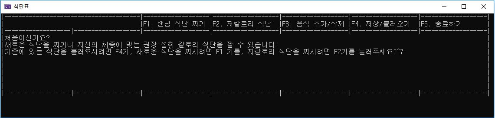
메인화면
<br>
<br>

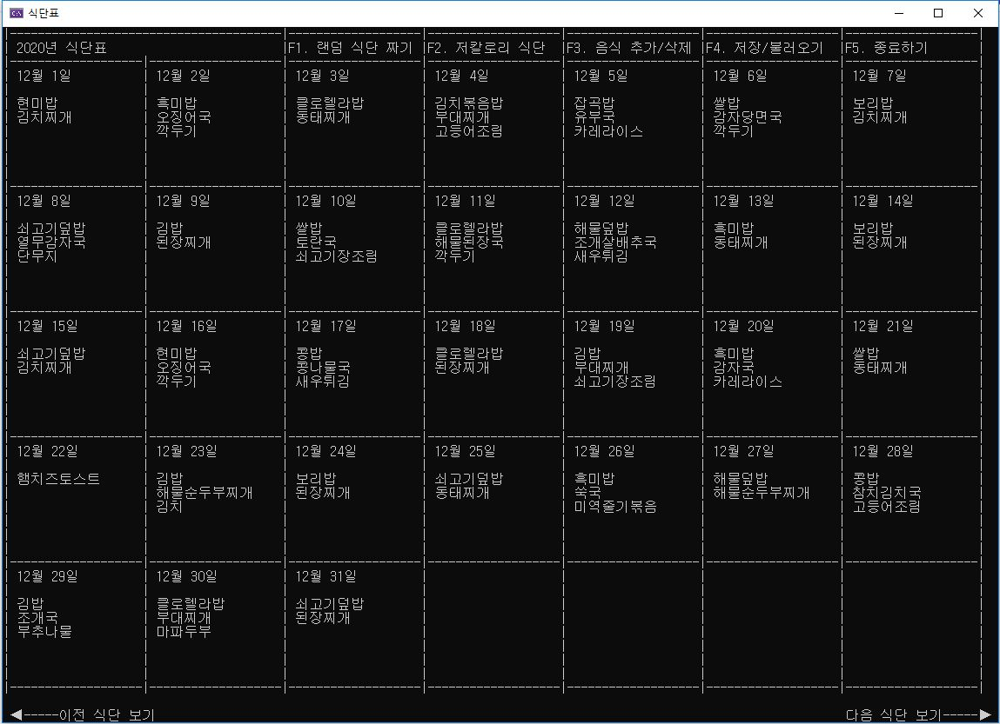
랜덤 식단
<br>
<br>

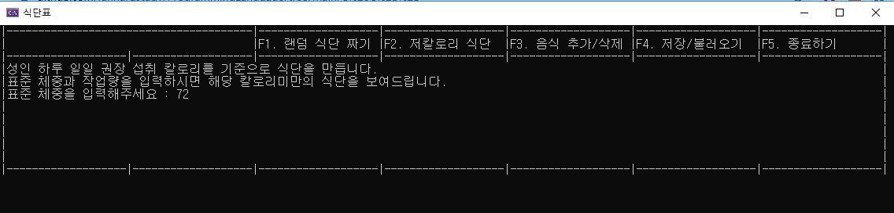
건강 식단 체중 입력
<br>
<br>

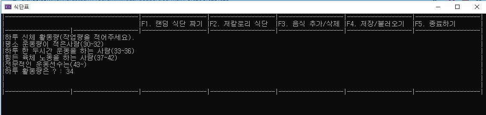
건강 식단 활동량 입력
<br>
<br>

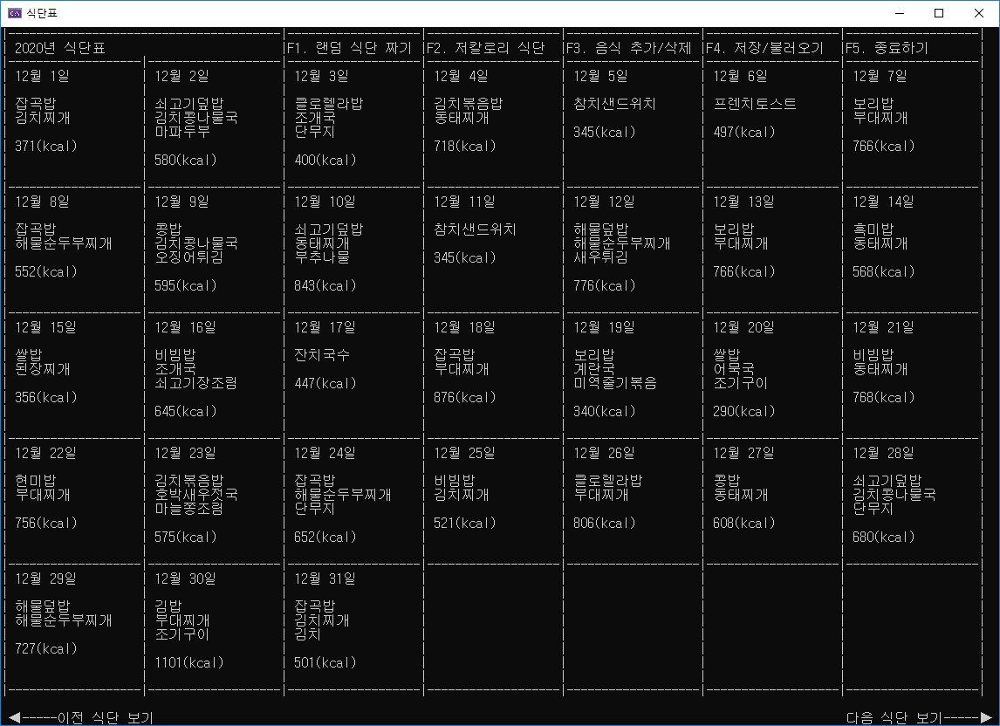
건강 식단
<br>
<br>

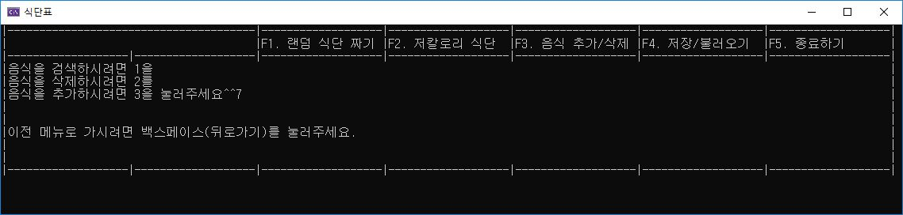
음식 추가/검색/삭제
<br>
<br>

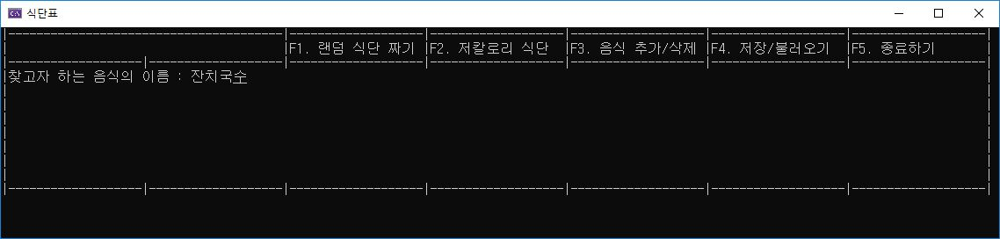
음식 검색
<br>
<br>

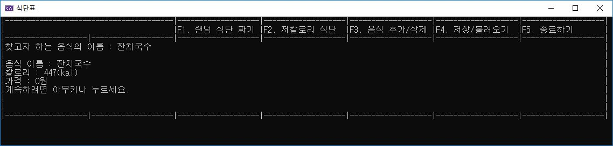
음식 검색 결과
<br>
<br>

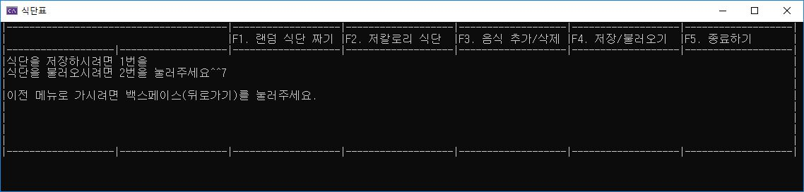
저장/불러오기
<br>
<br>

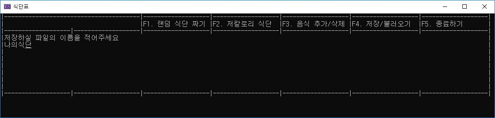

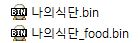


