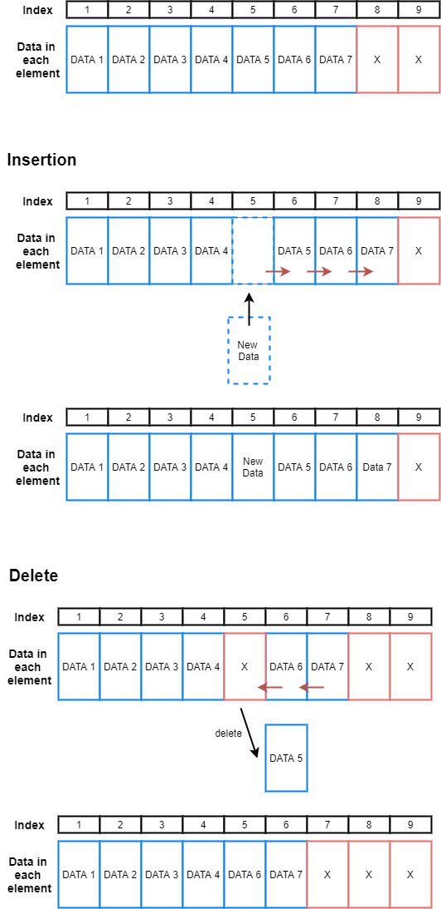
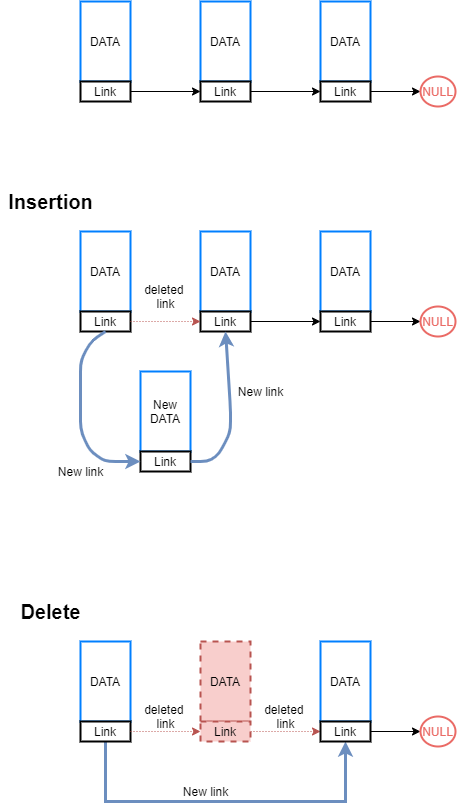
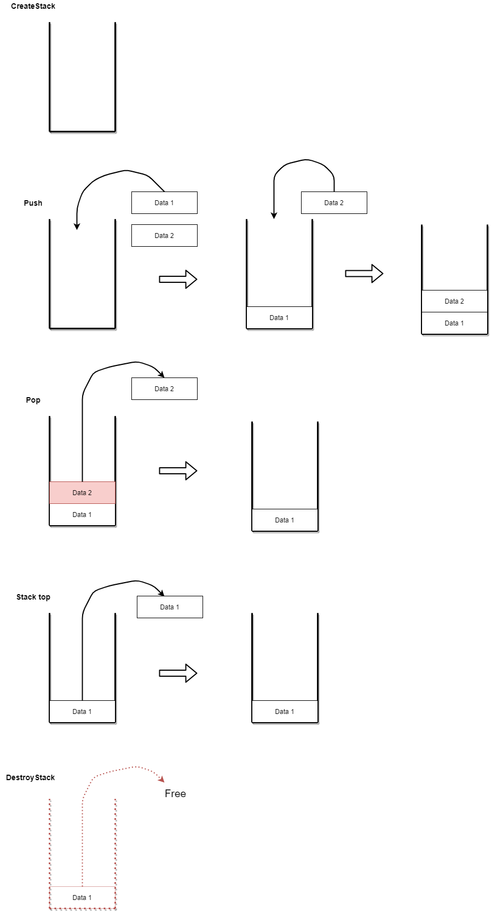

# 개요

1. Stack 구조를 linked list와 array 두 가지 버전으로 만듭니다.


2. Stack operation인 push, pop, top, destroystack, fullcheck, emptycheck, count, clear에 대해 정의 되어야 합니다.


3. Stack구조를 이용하여 입력된 데이터를 역순으로 출력합니다.


4. Stack구조를 이용하여, 10진수를 2진수로 변환합니다.


5. 수식을 하나의 문자열로 받은 다음, token을 분석하여 계산을 수행하는 계산기를 만듭니다.

***

## Linked list, and array

1. Array

각각의 data들이 논리적인 순서에서 연속적으로 데이터가 입력되면 <strong>물리적인 주소에서 순차적으로 배치</strong>됩니다. 이러한 데이터, 또는 원소들은 index로
 구별할 수 있으며 index로 인해, data에 대한 검색이 빠릅니다. 하지만 배열내의 데이터 원소의 추가 또는 삭제가 어렵습니다. 이는 추가 또는 삭제되는 
 데이터 원소의 인덱스 다음에 위치한 모든 데이터 원소에 대해 수정이 필요하기 때문입니다. 



2. Linked list

각각의 data들이 논리적인 순서에서 연속적으로 데이터가 입력되면 <strong>물리적인 주소에서는 순차적으로 배치되지 않습니다.</strong> 배열과 달리 index로 각 데이터들을
구별하지 않기 때문에, linked list내의 데이터들은 다음 데이터에 대한 주소를 기억해야 할 필요가 있습니다.(double linked list의 경우, 앞의 데이터에 
대한 주소도 기억해야 함) 따라서 특정 데이터를 찾으려면 linked list를 구성하는 데이터들을 순차적으로 따라가면서 찾아야 하므로, 배열보다는 검색이 느립니다.
하지만 새로운 데이터의 추가나 삭제는 link의 주소만 변경하면 되기 때문에 배열보다는 추가/삭제가 용이합니다.  



## Stack

새로운 데이터의 입력이나 삭제는 Top이라고 불리우는 한 곳에서만 이루어지며, 먼저 들어온 data가 가장 나중에 나오는 First in, Last out 구조입니다.


이러한 스택 구조에 대해서는 다음과 같은 <strong>기본적인 연산이 필요</strong>합니다.

1. CreateStack : 스택 생성


2. Push : 생성된 스택 구조에 새로운 데이터를 집어넣기


3. Pop : 스택 Top에서 데이터 하나를 가져오고 스택에서 제거하기


4. Stack top : 스택 Top에서 데이터 하나를 가져오기만 하기(only retrieve)


5. DestroyStack : 생성된 스택 구조를 메모리상에서 제거하여 자원을 반납하기




***

## 소스코드

```c
typedef struct {
	char char_data[1];
	int int_data;
}data;

typedef struct {
	data* element_data;
	int top;// equal size of stack(top + 1)
	int max_size_of_stack;

}stack_array;

typedef struct linked_data_inner {
	char* string_op;
	struct linked_data_inner* next;
	char char_data[1];
	int int_data;
}linked_data;

typedef struct {
	linked_data* top;
	int cur_size_of_stack;
}stack_linked;
```

먼저, 링크드 리스트의 경우 링크드 리스트 노드, 해당 노드에 들어갈 데이터, 마지막으로 스택에 대한 정의가 필요합니다.

링크드 리스트의 각 노드들은 다음 노드에 대한 주소를 알아야 합니다. 따라서 멤버에 자기 참조 구조체 포인터를 둡니다.
```c
struct linked_data_inner* next;
```

링크드 리스트 대입 사진


```c

```

