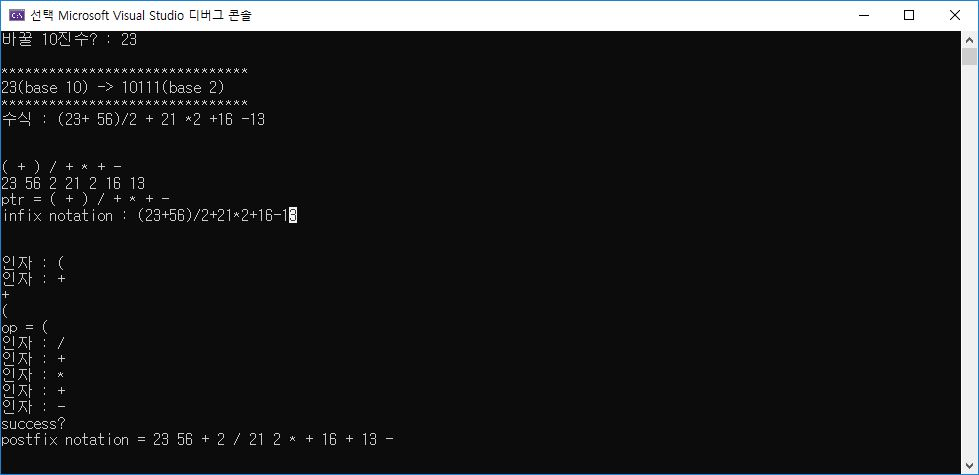

# 개요

1. Stack 구조를 linked list와 array 두 가지 버전으로 만듭니다.


2. Stack operation인 push, pop, top, destroystack, fullcheck, emptycheck, count, clear에 대해 정의 되어야 합니다.


3. Stack구조를 이용하여 입력된 데이터를 역순으로 출력합니다.


4. Stack구조를 이용하여, 10진수를 2진수로 변환합니다.


5. 수식을 하나의 문자열로 받은 다음, token을 분석하여 infix notation인 수식을 postfix notation으로 바꿉니다.

***

## Linked list, and array

1. Array

각각의 data들이 논리적인 순서에서 연속적으로 데이터가 입력되면 <strong>물리적인 주소에서 순차적으로 배치</strong>됩니다. 이러한 데이터, 또는 원소들은 index로
 구별할 수 있으며 index로 인해, data에 대한 검색이 빠릅니다. 하지만 배열내의 데이터 원소의 추가 또는 삭제가 어렵습니다. 이는 추가 또는 삭제되는 
 데이터 원소의 인덱스 다음에 위치한 모든 데이터 원소에 대해 수정이 필요하기 때문입니다. 


2. Linked list

각각의 data들이 논리적인 순서에서 연속적으로 데이터가 입력되면 <strong>물리적인 주소에서는 순차적으로 배치되지 않습니다.</strong> 배열과 달리 index로 각 데이터들을
구별하지 않기 때문에, linked list내의 데이터들은 다음 데이터에 대한 주소를 기억해야 할 필요가 있습니다.(double linked list의 경우, 앞의 데이터에 
대한 주소도 기억해야 함) 따라서 특정 데이터를 찾으려면 linked list를 구성하는 데이터들을 순차적으로 따라가면서 찾아야 하므로, 배열보다는 검색이 느립니다.
하지만 새로운 데이터의 추가나 삭제는 link의 주소만 변경하면 되기 때문에 배열보다는 추가/삭제가 용이합니다.  


## Stack

새로운 데이터의 입력이나 삭제는 Top이라고 불리우는 한 곳에서만 이루어지며, 먼저 들어온 data가 가장 나중에 나오는 First in, Last out 구조입니다.


이러한 스택 구조에 대해서는 다음과 같은 <strong>기본적인 연산이 필요</strong>합니다.

1. CreateStack : 스택 생성


2. Push : 생성된 스택 구조에 새로운 데이터를 집어넣기


3. Pop : 스택 Top에서 데이터 하나를 가져오고 스택에서 제거하기


4. Stack top : 스택 Top에서 데이터 하나를 가져오기만 하기(only retrieve)


5. DestroyStack : 생성된 스택 구조를 메모리상에서 제거하여 자원을 반납하기


***

## 소스코드

```c
typedef struct {
	char char_data[1];
	int int_data;
}data;

typedef struct {
	data* element_data;
	int top;// equal size of stack(top + 1)
	int max_size_of_stack;

}stack_array;

typedef struct linked_data_inner {
	char* string_op;
	struct linked_data_inner* next;
	char char_data[1];
	int int_data;
}linked_data;

typedef struct {
	linked_data* top;
	int cur_size_of_stack;
}stack_linked;
```

먼저, 링크드 리스트의 경우 링크드 리스트 노드, 해당 노드에 들어갈 데이터, 마지막으로 스택에 대한 정의가 필요합니다.


링크드 리스트의 각 노드들은 다음 노드에 대한 주소를 알아야 합니다. 따라서 멤버에 자기 참조 구조체 포인터를 둡니다.
```c
struct linked_data_inner* next;
```

링크드 리스트 대입 사진
<br>
<br>
<br>

```c
void push_linked(stack_linked* t1, int input_data) {
	linked_data* input;
	input = (linked_data*)malloc(sizeof(linked_data));
	
	input->int_data = input_data;
	
	if (t1->cur_size_of_stack == 0){
		
		input->next = NULL;
		
		t1->top = input;
	}
	else {		
		input->next = t1->top;
		t1->top = input;
	}
	++(t1->cur_size_of_stack);	
}
```
링크드 리스트로 구현된 스택 구조에서, stack push를 수행하는 함수입니다.


먼저 링크드 리스트로 구현되기 때문에, 스택에 들어갈 데이터에 대한 동적할당을 합니다.
동적할당된 구조체 데이터의 멤버에 실제 들어갈 데이터를 입력해주고, 스택의 사이즈를 조사하게 됩니다.


스택의 사이즈가 0이라면, 현재 스택은 비어있는 스택이므로 스택의 top이 새로 들어온 데이터(input 구조체 변수)를 가리키도록 합니다. 
그리고 스택의 바닥을 가리키도록 새로 들어온 데이터의 다음 link를 NULL로 초기화 합니다.


스택의 사이즈가 0이 아니라면, 새로 들어올 데이터의 link를 스택의 top이 가리키는 데이터를 지칭하도록 한다음에 스택의 top을 다시 새로 들어올
데이터에 가리키도록 바꿉니다.
<br>
<br>
<br>

```c
linked_data pop_linked(stack_linked *t1) {
	linked_data tmp;
	linked_data* prev_node;
	if (t1->top != NULL) {//exist data for retrieve at linked list
		tmp = *(t1->top);
		prev_node = t1->top;
		(t1->top) = t1->top->next;
		free(prev_node);//delete node when data was pop from stack
		t1->cur_size_of_stack--;
		return tmp;
	}
	else {
		printf("there is no data from stack!\n");
		printf("program will be terminated!\n");
		exit(-1);
	}
}
```
링크드 리스트로 구현된 스택 구조에서, pop을 수행하는 함수입니다.


먼저 스택의 top이 NULL을 가리키는지 검사하여 스택이 비어있는지 검사하게 됩니다.비어있다면, 메시지를 에러메시지를 출력하고 종료합니다.


비어있지 않다면, 임시 구조체 포인터 변수 tmp에 top이 가리키는 data 주소를 저장하게 됩니다. 이는 pop하고 난뒤에 자원반납(free)때 pop된
stack 원소에 대한 주소가 필요하기 때문입니다. 


스택의 top이 가리키던 구조체 멤버인 next를 통해 top 아래에 있는 구조체의 주소를 알 수 있으며, top이 이 주소를 지칭함으로써 스택 구조를 쉽게
변경할 수 있습니다.


변경후에는, 아까 저장한 tmp를 통해 pop된 동적할당 구조체에 대해 자원을 반납하게 됩니다.
<br>
<br>
<br>

```c
linked_data* Top(stack_linked* t1) {
	if (t1->top != NULL) {//exist data for retrieve at linked list
		return t1->top;
	}
	else {
		return NULL;
	}
}
```
Top연산의 경우, 단순히 스택의 Top이 가리키던 데이터만 읽으면(only retrieve) 됩니다. 
따라서 top이 가리키는 구조체에 대한 주소만 return해주면 됩니다. 
<br>
<br>
<br>

```c
void push(stack_array* t1, char sel, int input_data) {
	int check;
	check = full_check(t1);
	if (check == 0) {
		if (sel == 'c') {//character
			++(t1->top);
			(t1->element_data + t1->top)->char_data[0] = (char)input_data;
		}
		else if (sel == 'd') {//digit
			++(t1->top);
			(t1->element_data + t1->top)->int_data = (int)input_data;
		}
		else {
			printf("wrong selection!\n");
			exit(-1);
		}
	}
	else {
		printf("there is no space for pushing data into stack!\n");
		exit(-1);
	}

}
```
배열로 구현된 스택 구조에서, push 연산을 담당하는 함수입니다.


char sel이라는 flag변수를 통해, 스택에 넣는 데이터가 문자인지, 숫자(int)인지 구분합니다.

배열로 구현되어 있기 때문에 동적 할당을 이용하는 링크드 리스트와 달리 고정된 크기의 스택이 생성됩니다.
따라서 push를 하기전에 먼저 스택에 넣을 공간이 있는지 확인할 필요가 있습니다. 이를 full_check()라는 함수를 통해
스택이 가득 찼는지 확인합니다.

스택에 공간이 남아 있다면, 스택의 인덱스값을 저장하고 있는 멤버 top을 증가하게 되고, <strong>스택 배열 시작점 + 인덱스 값</strong>
을 하여 해당 위치에 데이터를 넣게 됩니다. 
<br>
<br>
<br>

```c
data* pop(stack_array *t1) {
	int check;

	check = check_empty(t1);
	if (check == 1)
		return (t1->element_data) + t1->top--;
	else {
		printf("there is no data for pop at stack!\n");
		exit(-1);
	}
}
```

배열로 구현된 스택에서 pop 연산을 수행하는 함수입니다.

배열형태의 스택은 링크드 리스트와 달리 값을 지운다거나 할 필요없이 논리적으로 index를 하나 감소시키는 방향으로 생각하였습니다.
즉, top을 단순히 하나 감소시키면 이전에 가리키던 top은 pop된 다음에 stack에서 지워졌다고 생각할 수 있습니다.

배열 형태이기 때문에, 인덱스 범위가 중요합니다. 따라서 먼저 해당 스택이 비어있는지 확인하는 check_empty()함수를 먼저 호출합니다.
이를 이용해, index가 0미만을 가리키도록 하는것을 방지할 수 있습니다.
<br>
<br>
<br>

```c
data* retrieve(stack_array* t1) {
	int check;
	check = check_empty(t1);
	if (check == 1)
		return (t1->element_data) + t1->top;
	else {
		printf("there is no data for retireve at stack!\n");
		exit(-1);
	}
}
```
배열로 구현된 스택에서 top연산을 수행하는 retrieve()함수 입니다.

여기서도 링크드 리스트와 마찬가지로, 단순히 값만 return 해주면 됩니다. 단, 배열이기 때문에 index가 0미만을 가리키지 않도록 하기 위해
check_empty()함수가 먼저 선행됩니다.
<br>
<br>
<br>

```c
void convert_to_binary(int decimal) {
	int tmp = decimal;
	stack_linked *t1;
	t1 = (stack_linked*)malloc(sizeof(stack_linked));
	t1->cur_size_of_stack = 0;
	t1->top = NULL;
	//char bin[30];//2E30 까지만 표현
	push_linked(t1, decimal % 2);
	decimal /= 2;
	while(decimal / 2 != 0)
	{

		push_linked(t1,	decimal % 2);
		decimal /= 2;
		
	}
	push_linked(t1, decimal % 2);
	printf("\n*******************************\n");
	printf("%d(base 10) -> ", tmp);
	print_all_data(t1);
	printf("(base 2)\n");
	printf("*******************************\n");

}
```

10진수를 2진수를 바꾸는 경우는 아래와 같이 나머지를 역으로 구하면, 표현할 수 있습니다.

나머지를 역으로 구하는 것을, 스택의 First In, Last Out구조를 이용하여 표현할 수 있습니다.


```c
while (equation[i] != NULL) {
		switch (equation[i++]) {
		case '(':
			array_operator[j] = '(';
			tmp_op[k++] = array_operator[j++];
			tmp_op[k++] = ' ';

			break;
		case ')':
			array_operator[j] = ')';
			tmp_op[k++] = array_operator[j++];
			tmp_op[k++] = ' ';
			break;
		case '+':
			array_operator[j] = '+';
			tmp_op[k++] = array_operator[j++];
			tmp_op[k++] = ' ';
			break;
		case '-':
			array_operator[j] = '-';
			tmp_op[k++] = array_operator[j++];
			tmp_op[k++] = ' ';
			break;
		case '*':
			array_operator[j] = '*';
			tmp_op[k++] = array_operator[j++];
			tmp_op[k++] = ' ';
			break;
		case '/':
			array_operator[j] = '/';
			tmp_op[k++] = array_operator[j++];
			tmp_op[k++] = ' ';
			break;
		case '%':
			array_operator[j] = '%';
			tmp_op[k++] = array_operator[j++];
			tmp_op[k++] = ' ';
			break;

		}
	}
	tmp_op[k] = NULL;
```

postfix로 바꾸기전에, 괄호와 연산자(+, -, *, /, %)만 tmp_op배열에 담아두는 부분입니다.

tmp_op의 경우, 아래와 같이 token으로 분리해야 하는데 token구분을 위해서 연산자, 띄어쓰기 형태로 저장됩니다.
<br>
<br>

```c
array_digit[0] = strtok(equation, " *+-/%()");
i = 0;
while (array_digit[i] != NULL) {
	array_digit[++i] = strtok(NULL, " *+-/%()");
}
```
방정식 equation 문자열에서 숫자만(only digit)만 추출해서 array_digit배열 변수에 저장하는 부분입니다.
<br>
<br>

```c
ptr_array_op[0] = strtok(tmp_op, " ");
i = 0;
while (array_operator[i] != NULL) {
	ptr_array_op[++i] = strtok(NULL, " ");
}
```
연산자 - 띄어스기 형태로 저장되어 있는 tmp_op배열에 대해 연산자만 strtok함수를 통해 추출하는 부분입니다.
 
이러한 오직 연산자만을 들고 있는 ptr_array_op배열과 오직 숫자만을 들고 있는 array_digit배열을 가지고
아래에서 띄어쓰기가 없는 infix notation 수식으로 먼저 만드는데 사용됩니다.
<br>
<br>
<br>

```c
i = 0;
j = 0;
k = 0;

while (ptr_array_op[i] != NULL) {
	if (!strcmp("(", ptr_array_op[i])) {
		infix[k++] = ptr_array_op[i++];

	}
	else if (!strcmp("+", ptr_array_op[i]) && j != 0) {

		infix[k++] = ptr_array_op[i++];
	}
	else if (!strcmp("-", ptr_array_op[i]) && j != 0) {
		infix[k++] = ptr_array_op[i++];
	}
	else if (!strcmp("/", ptr_array_op[i]) && j != 0) {
		infix[k++] = ptr_array_op[i++];
	}
	else if (!strcmp("%", ptr_array_op[i]) && j != 0) {
		infix[k++] = ptr_array_op[i++];
	}
	else if (!strcmp("*", ptr_array_op[i]) && j != 0) {
		infix[k++] = ptr_array_op[i++];
	}
	else {//닫힌 괄호 나왔을때
		if (j != 0) {
			infix[k++] = ptr_array_op[i++];
			continue;
		}
	}

	infix[k++] = array_digit[j++];
}
infix[k] = ptr_array_op[i];
```
<br>
<br>
<br>

```c
i = 0;
	j = 0;
	while (infix[i] != NULL) {
		if (!strcmp(infix[i], "(")) {
			push_string_linked(stack_operatror, infix[i]);
			i++;
		}
		else if (!strcmp(infix[i], "+") || !strcmp(infix[i], "-")) {
			access_stack_data = Top(stack_operatror);

			while (1) {
				access_stack_data = Top(stack_operatror);
				if (access_stack_data == NULL || !strcmp(access_stack_data->string_op, "(")) {
					break;
				}
				if (!strcmp(access_stack_data->string_op, "*") || !strcmp(access_stack_data->string_op, "/") || !strcmp(access_stack_data->string_op, "+") || !strcmp(access_stack_data->string_op, "-")) {
					real_data = pop_linked(stack_operatror);

					postfix[j++] = real_data.string_op;
				}
			}
			push_string_linked(stack_operatror, infix[i++]);
			postfix[j++] = infix[i++];
		}
		else if (!strcmp(infix[i], "*") || !strcmp(infix[i], "/")) {
			access_stack_data = Top(stack_operatror);
			if (access_stack_data == NULL) {
				push_string_linked(stack_operatror, infix[i++]);
				continue;
			}
			if (!strcmp(access_stack_data->string_op, "*") || !strcmp(access_stack_data->string_op, "/")) {
				real_data = pop_linked(stack_operatror);
				push_string_linked(stack_operatror, infix[i]);
				i++;
				postfix[j++] = real_data.string_op;
				postfix[j++] = infix[i];//operator 다음에는 무조건 operand가 옴
				i++;
			}
			else {
				push_string_linked(stack_operatror, infix[i]);
				i++;
			}
		}
		else  if (!strcmp(")", infix[i])) {//닫힌 괄호가 오는 경우
			i++;
			while (1) {

				real_data = pop_linked(stack_operatror);
				printf("%s \n", real_data.string_op);
				if (!strcmp(real_data.string_op, "(")) {
					printf("op = %s\n", real_data.string_op);
					break;
				}
				postfix[j++] = real_data.string_op;
			}
		}
		else {//숫자일 경우	
			postfix[j++] = infix[i];
			i++;
		}
	}
```
이제 띄어쓰기가 없는 형태의 infix notation 수식에서 postfix notation 수식으로 바꾸게 됩니다.

전체적인 알고리즘은 다음과 같습니다.

1. 입력은 infix notation

2. 입력을 한글자씩 읽어들일 때, 숫자이면 피연산자 이므로 postfix notation에 바로 대입합니다.

3. 연산자(+, -, *, /, %)의 경우 현재 스택의 top의 data보다 우선순위가 높을때까지 pop하여 스택에 저장되어 있던 데이터를 읽어들입니다. 그리고 우선순위가 높아졌다면 top에 해당 연산자를 데이터로 넣습니다.

4. 왼쪽 괄호인 경우, 오른쪽 괄호가 등장하기 전까지 등장하는 연산자들을 연산자 스택(stack_operatror)에 넣습니다.

5. 오른쪽 괄호인 경우, 연산자 스택(stack_operatror)에 저장된 왼쪽 괄호가 등장하기 전까지 모든 연산자들을 pop합니다.

이러한 알고리즘을 (23+56)/2+21*2+16-13 수식을 이용해서 예를 들겠습니다.

먼저 왼쪽 괄호 '('를 스택에 넣습니다. 이는 우선순위가 높은 괄호가 등장하기 때문입니다. 

stack_operatror : (

postfix : 
<br>
<br>
다음으로 23 숫자가 등장하므로, postfix notation에 바로 적습니다.

stack_operatror : (

postfix : 23
<br>
<br>
다음은 +연산자가 등장하므로, 연산자 스택을 조사합니다. 현재 ( 괄호만 저장되어 있으므로 따로 pop할 필요가 없습니다.

따라서 +연산자를 연산자 스택에 push 해놓습니다.

stack_operatror : ( +

postfix : 23
<br>
<br>
다음은 56 숫자가 등장하므로, postfix notation에 바로 적습니다.

stack_operatror : (

postfix: 23 56
<br>
<br>
다음으로 닫힌 괄호가 등장합니다. 이는 왼쪽 괄호가 등장하기 전까지 연산자 스택을 pop하면서 postfix에 바로 적습니다.

stack_operatror : empty

postfix : 23 56 +
<br>
<br>
다음으로 / 연산자입니다. 피연산자(숫자)가 등장하기 전이므로, 스택이 비어있으므로 스택 연산자에 넣게 됩니다.

stack_operatror : /

postfix : 23 56 + 
<br>
<br>
다음은 숫자 2입니다. 마찬가지로 숫자는 바로 적습니다.

stack_operatror : /

postfix : 23 56 + 2
<br>
<br>
다음은 +연산자 입니다.스택을 검사하면 현재 스택 연산자에는 / 연산자가 있습니다. 따라서 +보다 우선순위가 높은 연산자가 나올때까지
스택연산자를 pop하게 됩니다. 스택 연산자에는 / 연산자만 있고, /연산자를 만나면 /을 pop하고 +연산자를 연산자 스택에 넣습니다.

stack_operatror : +

postfix : 23 56 + 2 /
<br>
<br>
이와 같은 과정을 반복하면 아래와 같은 postfix notation이 완성됩니다.

postfix : 23 56 + 2 / 21 2 * + 16 + 13 -

***

## 결과




