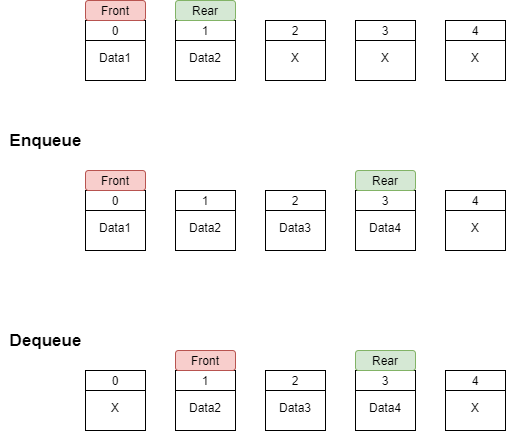
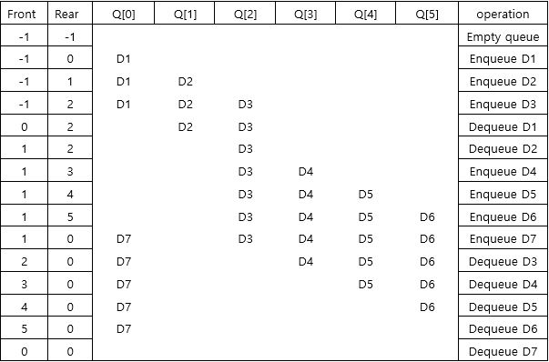
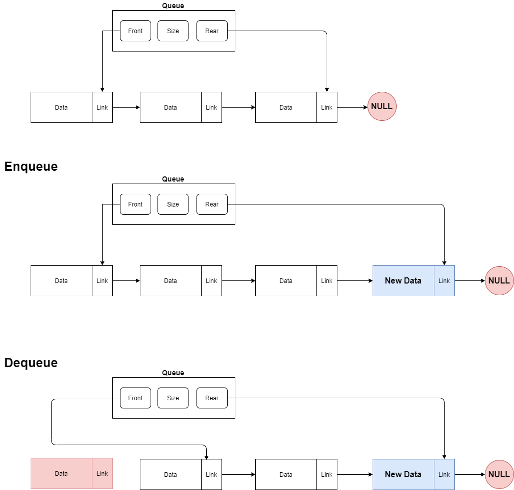
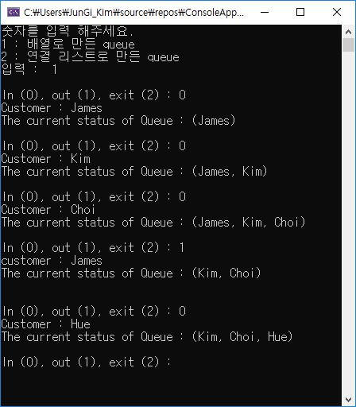
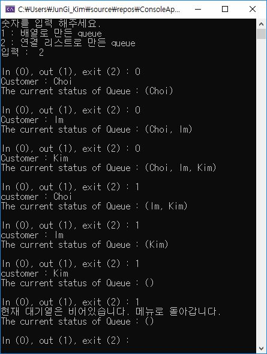

# 개요

1. 배열로 큐 구조를 만들었습니다.

2. 링크드 리스트로 큐 구조를 만들었습니다.

3. 큐에 필요한 여러 operation이 정의되어 있습니다.

4. 위에서 언급한 것들을 바탕으로, 은행 이용자들의 예약 대기열을 만들어봅니다.


***

## Queue

큐(Queue)의 경우, 스택과는 다르게 한쪽 방향으로만 데이터의 삽입이 이루어지고 다른 한쪽 방향으로만 오직 데이터의 추출이 이루어집니다.
<br>
따라서, 첫번째로 들어온 데이터가 첫번째로 읽을수 있으므로 First In, First Out구조를 지닙니다.
<br>
<br>
큐 구조에 대해서는 다음과 같은 기본 연산이 필요합니다.

1. Enqueue : 큐에 데이터를 삽입합니다

2. Dequeue : 큐에서 데이터를 가져옵니다.

3. QueueRetrieve : 큐에서 데이터를 읽어옵니다(only retrieve, not delete) 

## Array로 구현된 Queue



먼저 데이터가 삽입되는 쪽을 Rear, 데이터를 추출하는 쪽을 Front라고 한다면 배열에서는 논리적으로 index의 값을 통해 Front와 Rear를
지정할 수 있습니다.

본 프로그램에서는 배열 사이즈를 6으로 잡았습니다.

사이즈가 6인 배열에 대해 index를 이용한 큐구조는 아래와 같이 대응될 수 있습니다.



즉 Enqueue, Dequeue를 할때마다 index들이 변경되어 논리적으로 Rear와 Front를 담당합니다.

큐가 가득찼는지, 비었는지를 확인하려면 아래 조건을 확인하면 됩니다.

Index condition

1. Front == Rear -> Empty Queue

2. Front == (Rear + 1)%Queue_size -> Full Queue

## Linked list로 구현된 Queue



Linked list로 구현하는 경우, Queue를 담당하는 데이터를 만든뒤 해당 Queue데이터에서 Front와 Rear를 주소값으로 확인합니다.

Queue데이터의 Front와 Rear만 명시해주면, 큐 내부에서는 링크드 리스트 구조형태 때문에 서로 link로 연결되어 있습니다.


***

## 소스코드

```c
typedef struct {
	char name[20];
}customer_info;

typedef struct {
	customer_info* customer[6];
	int front;
	int rear;
	int size;

}queue_array;
```
배열로 큐구조를 생성할 때, 필요한 구조체들입니다.

배열로 생성하기 때문에, 선언시에 큐의 구조가 이미 정해집니다.

Front와 Rear는 배열의 index를 통해 구분합니다.
<br>
<br>
<br>

```c
typedef struct customer_node{
	char name[20];
	struct customer_node* next;
}Node;

typedef struct {
	
	Node* front;
	Node* rear;
}queue_linked_list;
```
링크드 리스트로 큐구조를 생성할 때, 필요한 구조체들입니다.

링크드 리스트 형태이기 때문에, 큐의 각 데이터들은 노드로 생각할 수 있으며 링크드 리스트의 특성상 다음 노드에 대한 주소정보가 필요하므로 자기 참조
구조체를 통해 다음노드와 이어줍니다.

배열과 달리 동적할당을 하기때문에 큐 사이즈가 고정되지 않습니다.
<br>
<br>
<br>

```c
queue_array* make_queue_array() {
	queue_array* bank;
	int i;
	bank = (queue_array*)malloc(sizeof(queue_array));

	bank->front = 0;
	bank->rear = 0;
	bank->size = 6;

	for (i = 0; i < 6; i++) {
		bank->customer[i] = NULL;
	}
	return bank;
}
```
배열 형태의 큐 자체를 생성하는 함수입니다. 따라서 큐 자체에는 동적할당을 하였고, 내부에 큐의 사이즈는 멤버의 배열크기인 6으로 고정되어 있습니다.
<br>
<br>
<br>

```c
int enqueue_array(queue_array* bank) {
	customer_info* gogek;
	char customer_name[20];

	if (check_queue_array_full(bank)) {
		gogek = (customer_info*)malloc(sizeof(customer_info));
		printf("Customer : ");
		scanf("%s", gogek->name);
		bank->customer[bank->rear] = gogek;
		++(bank->rear);
		(bank->rear) %= bank->size;
		return 1;
	}
	else {
		printf("대기열이 모두 찼습니다. 초기화면으로 돌아갑니다.\n");
		return 0;
	}
	
}

int dequeue_array(queue_array* bank) {
	if (check_queue_array_empty(bank)) {
		printf("customer : %s\n", bank->customer[bank->front]);
		free(bank->customer[bank->front]);
		++(bank->front);
		bank->front %= bank->size;
		return 1;
	}
	else {
		printf("대기열이 없습니다. 초기화면으로 돌아갑니다.\n");
	}//비어있는 경우
}
```
각각 큐에 데이터를 삽입하는 Enqueue 역할의 함수와 큐에 있는 데이터를 뽑아오는 Dequeue역할의 함수입니다.

Enqueue의 경우, 배열 형태이기 때문에 큐의 사이즈가 고정되어 있습니다. 그러므로 큐의 size에 빈공간이 있는지를 확인하는 
check_queue_array_full()가 선행이 됩니다.

Dequeue의 경우, 마찬가지로 존재하지 않는 index를 건들이면 안되므로 큐가 비어있는지 먼저 확인하는 함수 check_queue_array_empty()
를 호출합니다.
<br>
<br>
<br>

```c
queue_linked_list* make_queue_linked_list() {
	queue_linked_list* bank;
	bank = (queue_linked_list*)malloc(sizeof(queue_linked_list));
	bank->front = NULL;
	bank->rear = NULL;
	return bank;
}
```
링크드 리스트 형태로 구현된 큐 구조 자체를 생성하는 함수입니다. 여기서는 Front와 Rear를 동적할당되는 링크드 리스트의 노드 주소값으로 구분합니다.
<br>
<br>
<br>

```c
int enqueue_linked_list(queue_linked_list* bank) {
	Node* new_node = (Node*)malloc(sizeof(Node));
	printf("Customer : ");
	scanf("%s", new_node->name);
	
	new_node->next = NULL;
	if (bank->front == NULL && bank->rear == NULL) {
		bank->front = new_node;
		bank->rear = new_node;
		return 1;
	}
	else {
		bank->rear->next = new_node;
		bank->rear = new_node;
		return 1;
	}
}

int dequeue_linked_list(queue_linked_list* bank) {
	Node* tmp;
	if (bank->front == NULL && bank->rear == NULL) {
		printf("현재 대기열은 비어있습니다. 메뉴로 돌아갑니다.\n");
		return 0;
	}
	if (bank->front != NULL) {
		printf("customer : %s\n", bank->front->name);
		tmp = bank->front;
		bank->front = bank->front->next;
		if (tmp == bank->rear )bank->rear = NULL;
		free(tmp);
		return 1;
	}
	else {
		printf("현재 대기열은 비어있습니다. 메뉴로 돌아갑니다.\n");
		return 0;
	}
}
```
각각 링크드 리스트로 구현된 큐에 데이터를 삽입하는 enqueue함수와 데이터를 추출하는 dequeue함수입니다.

enqueue_linked_list()함수의 경우, 간단하게 새로운 데이터를 추가하기 전에 현재 rear가 가리키는 node의 
next 주소를 추가하려는 새로운 데이터를 가리키도록 합니다. 그리고 마지막으로 rear가 새롭게 추가된 데이터 노드를 지칭하게 합니다.

dequeue_linked_list()함수의 경우, enqueue_linked_list()보다는 노드의 수정이 약간 복잡합니다.
비어있는 큐가 아니라면, dequeue각 일어나는데 dequeue를 하기전에 rear가 가리키는 노드를 따로 저장해야합니다.

이는 만약 큐가 하나의 노드만 가지고 있다면, front와 rear의 주소를 초기화해야 합니다. 이를 알기 위해서 tmp라는 변수에 따로 dequeue된
노드의 주소를 저장하였습니다.
<br>
<br>
<br>

***

## 결과

1. 배열 큐



<br>
<br>

2. 링크드 리스트 큐

