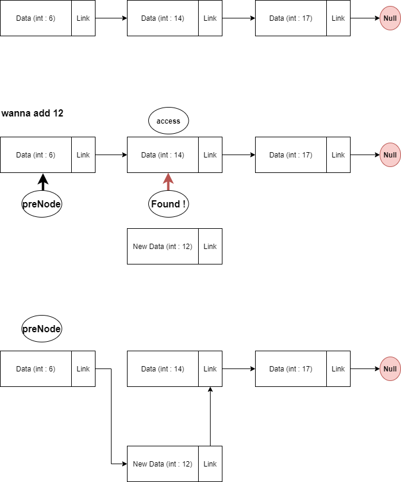
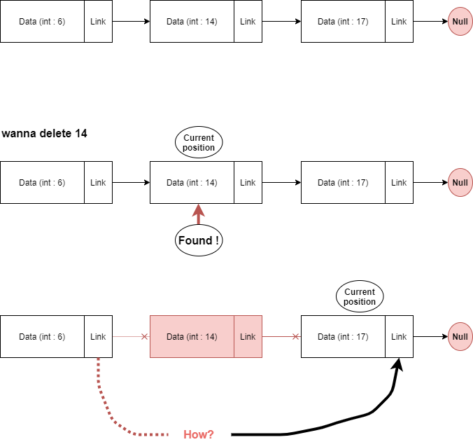
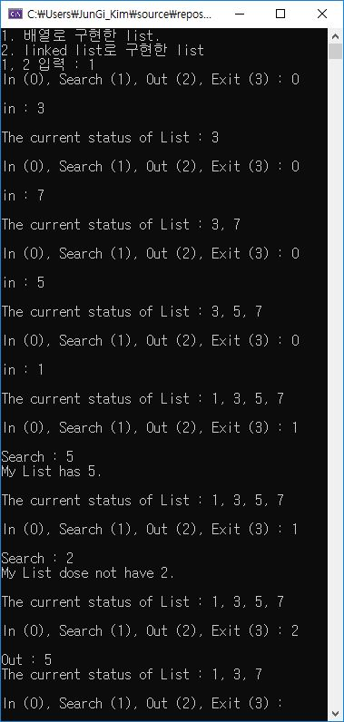
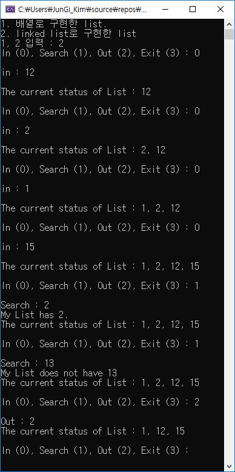

# 개요

1. Sorted list를 array와 linked list 두 가지 버전으로 구현합니다.

2. 1의 설계 조건에서 새로운 정수가 입력되었을 때, 정렬된 형태를 유지하도록 구현합니다.

3. Search가 구현되어야 합니다.

## General linear list

정렬 된 리스트(ordered list)형태에서 아래와 같은 연산이 수행되어야 합니다.

1. Insertion : 데이터가 list에 추가 됩니다. 이 때, 정렬된 순서(sequence)를 유지해야 합니다.

2. Deletion : list에서 데이터가 제거 됩니다. 마찬가지로, 정렬된 순서(sequence)를 유지해야 합니다.

3. Retrieval : list내에서 특정 데이터를 찾아(search)줍니다.

4. Traversal : list내에 있는 모든 데이터를 한 번씩 방문하는 연산입니다. 이 연산을 통해 모든 데이터를 출력하거나 다른 작업이 더해질 수 있습니다.

***

## 소스 코드

```c
typedef struct {
	int num;
}data;

typedef struct {
	data* elements;
}list_array;

typedef struct in_node {
	int num;
	struct in_link* next;
}Node;

typedef struct {
	Node* link_head;
}head;
```

linear list, 배열, 그리고 링크드 리스트에 필요한 데이터 타입들입니다.
<br>
<br>
<br>

```c
void insert_array(Node* a[]) {
	Node* tmp;
	printf("in : ");
	tmp = (Node*)malloc(sizeof(Node));
	scanf("%d", &(tmp->num));
	printf("\n");
	tmp->next = NULL;
	check_array(a, tmp);
}

void check_array(Node* a[], Node* input) {
	int i = 0, j;
	int tmp_index;
	Node* tmp;
	Node* s_n;//for swap
	Node* t_n;//for temporarily
	if (a[0] == NULL) {
		a[0] = input;
		return;
	}
	while (a[i] != NULL) {
		
		if (a[i]->num > input->num) {
			tmp_index = i;
			s_n = a[i];
			for (j = i; a[j] != NULL; j++) {
				t_n = a[j + 1];
				a[j + 1] = s_n;
				s_n = t_n;

			}
			a[tmp_index] = input;
			return;
		}
		else i++;
	}
	a[i] = input;
}
```

배열 형태로 구현된 linear list에 대해서 insertion연산을 수행하는 insert_array()함수입니다.

새로운 데이터(Node)가 추가 되더라도, 정렬된 형태를 유지해야 하므로 check_array()함수를 호출하게 됩니다.

check_array()함수에서는 새로 추가되는 Node input의 적절한 위치를 찾은 다음 추가해주고, 추가된 위치 이후에 존재하던
모든 Node들을 오른쪽으로 1칸씩 index를 옮깁니다.
<br>
<br>
<br>

```c
void out_array(Node* a[], int target) {
	int i = 0, j;
	while (a[i] != NULL) {
		if (a[i]->num == target) {
			for (j = i; a[j] != NULL; j++) {
				a[j] = a[j + 1];
			}
			return;
		}
		else {
			i++;
		}
	}
	printf("My List dose not have %d.\n", target);
}
```

배열 형태로 구성된 linear list에서 deletion을 수행하는 함수입니다.

insertion연산에서 처럼 부분적으로 index위치 변경이 필요합니다. 제거 해야할 노드의 index위치를 찾게 되면 
반대로 index를 한칸씩 앞으로 당겨줍니다.
<br>
<br>
<br>

```c
void insert_Node(head* list_head) {
	Node* tmp;
	printf("in : ");
	tmp = (Node*)malloc(sizeof(Node));
	scanf("%d", &(tmp->num));
	printf("\n");
	tmp->next = NULL;
	check_insertion(tmp, list_head);
}

void check_insertion(Node* input, head* list_head) {
	int i, j, k;
	Node* preNode;
	Node* access;

	access = list_head->link_head;

	if (list_head->link_head == NULL) {
		list_head->link_head = input;
		return;
	}

	if (input->num < access->num) {
		input->next = list_head->link_head;
		list_head->link_head = input;
		return;
	}//first
	else {
		while (access->next != NULL) {
			preNode = access;
			access = access->next;
			if (input->num < access->num) {
				input->next = preNode->next;
				preNode->next = input;
				return;
			}
		}//middle
		access->next = input;
		return;//last
	}

}
```
이번에는 링크드 리스트로 구현된 linear list에 대한 insertion연산 입니다.

배열에서와 마찬가지로, 링크드 리스트에서 insertion을 수행할 때 적절한 노드의 위치를 찾고 수정하기 위해 check_insertion()함수를 호출합니다.

check_insertion()함수의 경우, Node의 link를 따라가면서 적절한 위치를 찾게 됩니다. 링크드 리스트이므로 중간에 위치한 데이터의 순서를 수정할 때 이전 노드의 주소를 알아야 할 필요가 있습니다.
더블 링크드 리스트로 구현이 되면 하나의 노드위치만 알아도 인접한 앞, 뒤 노드의 위치를 알수 있지만 싱글 링크드 리스트 이기때문에 따로 처리가 필요합니다. 

이런 처리는 preNode라는 임시 Node구조체 변수에 다음 Node를 찾기 전에 현재 Node의 주소를 저장하게 됩니다.그리고 적절한 위치를 찾으면 preNode의 Next는 새로 들어오는 데이터 input을
가리키게 되고, 새로 들어온 input의 next는 아까 찾은 적절한 위치에 존재하는 노드를 참조합니다.



```c
Node* search(head* list_head, int target_num, int mode) {//when mode is zero, only perform search,
													   // otherwise perform search and deletion(out)
	Node* access;
	Node* preNode;
	Node* tmp;
	access = list_head->link_head;
	preNode = access;
	while (access != NULL) {
		if (access->num == target_num) {
			if (mode != 0) {//when deletion perform at head
				if (access == list_head->link_head) {
					tmp = list_head->link_head->next;
					free(access);
					list_head->link_head = tmp;
					return tmp;
				}//when deletion perform all exclude head position.
				else {
					preNode->next = access->next;
					free(access);
					return list_head->link_head;
				}
			}
			else
				return access;//if found the data, it'll be return address of where is data stored.
		}
		else {
			preNode = access;
			access = access->next;
		}
	}
	return NULL;//it can't be found.
}
```
링크드 리스트로 구현된 linear list에 대한 search와 deletion연산을 같이 구현해 놓은 함수입니다.

mode라는 flag 매개변수값을 받아서 하나의 함수가 두 기능을 모두 수행할 수 있게 하였습니다.

search와 deletion모두 특정 노드를 찾아야 하므로, 링크에 연결된 모든 노드들을 검사하게 됩니다.
특히 deletion에서는 check_insertion()와 마찬가지로 링크드 리스트의 Header가 아닌 Node를 제거할 때는, 지우려는 Node의 이전 Node 주소를 기억할 필요가 있습니다.
만약 이전 Node의 위치를 기억하지 못한다면 이전 Node의 next가 지워지는 노드의 Next가 가리키는 노드를 참조할 수 없습니다.



```c
void list_array_show(Node* a[]) {
	int i = 0;
	printf("The current status of List : ");
	while (a[i] != NULL) {
		printf("%d", *a[i++]);
		if (a[i] != NULL)printf(", ");

	}
	printf("\n\n");
}
void list_show(head* list_head) {
	Node* access;
	int i;
	access = list_head->link_head;
	printf("The current status of List : ");
	for (i = 0; access != NULL; i++) {
		printf("%d", access->num);
		if (access->next != NULL)printf(", ");
		access = access->next;

	}
	printf("\n\n");
}
```
나머지 두 함수는 각각 배열과 링크드 리스트로 구현된 linear list내에 있는 모든 data들을 표시하는 traversal 기능을 담당하는 함수입닌다.

***


## 결과



배열로 구현한 linear list
<br>
<br>



링크드 리스트로 구현한 linear list