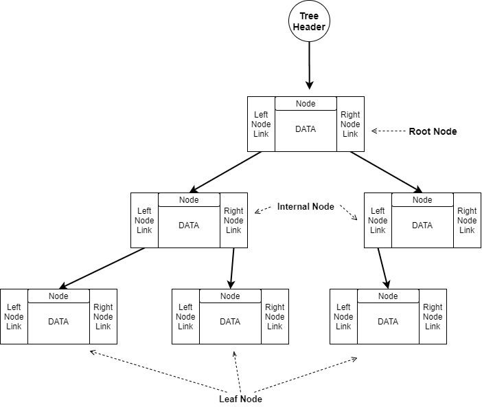
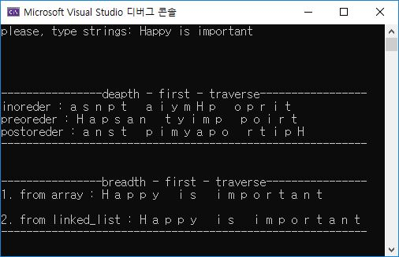

# 개요

1. Binary tree를 구현한 코드입니다.

2. 문자열을 입력받아 complete binary tree에 저장한 후, depth-first traversal의 preorder, inorder, postorder순으로 출력합니다.

3. 2번 요구 사항에 대해서 breath-first traversal로도 출력합니다.

4. 링크드 리스트로 구현되어 있습니다.

## Binary Tree



Tree를 구성하고 있는 node가 둘 이상의 subtree는 가질 수 없는 구조입니다.

Height(Depth) : Leaf Node에서 Root Node까지 가질 수 있는 가장 긴 경로

1. Full Binary Tree

Binary Tree가 가질 수 있는 height(depth)에서 최대의 개수로 Node를 가지는 Tree

2. Complete Binary Tree

가지고 있는 Node의 개수에서 최소한의 height(depth)를 가지고, 마지막 tree의 level에서는 모든 노드들이 left 또는 
left subtree에 위치하는 Binary Tree

Binary Tree에서는 다음과 같은 연산이 요구됩니다.

1. CreateTree : Binary Tree구조를 만드는 연산입니다

2. LeftTree : Binary Tree에서 특정 Node의 left subtree를 return합니다

3. RightTree : Binary Tree에서 특정 Node의 right subtree를 return합니다

4. TreeData : Binary Tree에서 Root Node의 data를 return합니다

5. TreeIsEmpyth : Binary Tree가 비어있는지 확인합니다

6. DestroyTree : Binary Tree를 삭제하고, 관련된 resource를 반납하는 연산입니다

## DFS

깊이 우선 탐색(Depth First Search)으로, Root Node에서 시작하여 다음 branch(분기하는 Node의 RightSubTree)로 가기전에
깊이를 우선하여 최대한 가능할 수있는 Node를 먼저 탐색하는 방법입니다.

구현은 Stack, Recursion으로 구현할 수 있습니다.  

## BFS

너비 우선 탐색(Breadth First Search)으로, Root Node에서 시작하여 아래 depth를 방문하기 전에 같은 level상에 위치한 Node들을
left에서 right로 먼저 탐색하는 방법입니다.

구현은 Queue를 이용해서 구현할 수 있습니다. 또는 만약 Binary Tree를 배열 형태로 표현하였다면 단순히 index순으로 탐색하면 됩니다. 올린 소스
코드의 경우 배열을 이용하여 BFS를 구현하는 방법과 Queue를 이용하는 방법이 있습니다.

***

## 소스 코드

```c
typedef struct {
	char element;
	struct CBT_Node* left;
	struct CBT_Node* right;
}CBT_Node;

typedef struct {
	struct CBTNode* elemnt;
	struct queue_element* next;
}queue_element;

typedef struct {
	struct queue_element* first;
	struct queue_element* last;
}queue;
```
Binary Tree를 구성하는 Node의 구제체 타입선언과 DFS 구현에 쓰일 Queue구조에 대한 자료형 타입선언부입니다.
<br>
<br>
<br>

```c
array_CBT = (CBT_Node*)malloc(sizeof(CBT_Node) * strlen(input) + 1);

	for (i = 0; i < strlen(input); i++) {
		tmp = (CBT_Node*)malloc(sizeof(CBT_Node));
		tmp->element = input[i];
		tmp->left = NULL;
		tmp->right = NULL;

		*(array_CBT + i + 1) = tmp;
	}
	i = 0;
	while (++i < strlen(input)) {
		if (strlen(input) + 1 <= 2 * i)break;
		(*(array_CBT + i))->left = (*(array_CBT + 2 * i));
		if (strlen(input) + 1 <= 2 * i + 1)break;
		(*(array_CBT + i))->right = (*(array_CBT + 2 * i + 1));
	}
```
먼저 Binary Tree를 배열 형태로 표현하고 -> 링크드 리스트 형태로 바꾸는 로직입니다.

입력받은 문자열에서 개개의 문자를 저장할 Node를 생성하고, Node를 생성할 때 마다 순차적으로 배열에 넣게됩니다. <strong>여기서 주의할점은 배열에서는 index를 1부터 시작되도록 하기 위해
문자열 사이즈 + 1 크기를 할당합니다.</strong>
<br>
<br>
모든 배열에 Node를 넣은 다음에는 배열의 index와 Binary Tree의 level과의 관계를 이용해서 링크드 리스트형태의 Binary Tree를 생성하게 됩니다.

어떤 ancestor node와 그 child node의 관계는 아래 조건을 만족합니다.

<table>
<tr>
<th>left child node index</th>
<th>right child node index</th>
</tr>
<tr>
<td> array_CBT + 2 * i</td>
<td> array_CBT + 2 * i + 1</td>
</tr>
</table>

#### array_CBT = 배열의 시작주소


<br>
<br>
<br>

```c
void print_inorder(CBT_Node* cbt) {//left_subtree -> center -> right_subtree
	if (cbt->left != NULL)print_inorder(cbt->left);
	printf("%c ", cbt->element);
	if (cbt->right != NULL)print_inorder(cbt->right);
}

void print_preorder(CBT_Node* cbt) {//center -> left_subtree -> right_subtree
	if (cbt != NULL)printf("%c ", cbt->element);
	else return;

	if (cbt->left != NULL)print_preorder(cbt->left);
	if (cbt->right != NULL)print_preorder(cbt->right);
}

void print_postorder(CBT_Node* cbt) {//left_subtree -> right_subtree -> center
	if (cbt == NULL)return;
	else {
		if (cbt->left != NULL)print_postorder(cbt->left);
		if (cbt->right != NULL)print_postorder(cbt->right);
	}
	printf("%c ", cbt->element);
}
```
DFS를 이용하여, preorder, inorder, postorder순으로 각각 탐색해주는 함수입니다. recursion으로 구현하였습니다.
recursion이므로, <strong>모두 종료조건이 반드시 로직에서 선행되어야 합니다.</strong>

1. Preorder

center -> left subtree -> right subtree

preorder의 경우, center(자기 자신 node)를 먼저 출력하고 left subtree에 대해서 다시 재귀함수를 호출하게 됩니다. 만약에 left subtree가 없다면
 right subtree에 대해서 재귀함수를 호출합니다.


2. Inorder

left subtree -> center -> right subtree

inorder의 경우, 현재 node에서 left subtree가 존재하면 left subtree에 대해서 다시 재귀함수를 호출합니다. left subtree가 없다면 자기 자신을 출력하고
right subtree에 대해서 다시 재귀함수를 호출합니다. right subtree의 경우, left subtree가 없다면 자기 자신을 출력합니다.


3. Postorder

left subtree -> right subtree -> center

postorder의 경우, left subtree와 right subtree가 모두 없을 때 자기 자신을 출력할 수 있습니다. 만약 left 또는 right subtree가 존재할 경우,
 순차적으로 각각 재귀함수를 호출하게 됩니다.


<br>
<br>
<br>

```c
void destroy_CBT(CBT_Node* cbt) {
	if (cbt == NULL)return;
	else {
		if (cbt->left != NULL)destroy_CBT(cbt->left);
		if (cbt->right != NULL)destroy_CBT(cbt->right);
	}
	free(cbt);
}
```
complete binary tree를 제거하는 함수입니다. 동적할당이 되어있는 링크드 리스트형태이므로, <strong>반드시 재귀 종료 조건은 로직에서 가장 먼저 수행되어야 합니다.</strong>

<br>
<br>
<br>

```c
void print_breadth_first_traverse(CBT_Node** array_CBT, int number_Nodes) {
	int i = 0;
	for (i = 0; i < number_Nodes; i++) {
		printf("%c ", (*(array_CBT + i + 1))->element);
	}
}
```
배열형태로 표현된 complete binary tree를 BFS로 출력하는 함수입니다. 배열로 표현되어 있기 때문에 단순히 index순으로 탐색하면 됩니다.
<br>
<br>
<br>

```c
void print_breadth_first_traverse_2(CBT_Node* cbt) {
	queue* q;
	q = (queue*)malloc(sizeof(queue));
	q->first = NULL;
	q->last = NULL;

	while (cbt != NULL) {

		if (cbt->left != NULL)enqueue(q, cbt->left);
		if (cbt->right != NULL)enqueue(q, cbt->right);
		printf("%c ", cbt->element);
		cbt = dequeue(q);
	}

}

void enqueue(queue* q, CBT_Node* new_Node) {
	queue_element* tmp = (queue_element*)malloc(sizeof(queue_element));
	queue_element* read_tmp;
	tmp->elemnt = new_Node;
	tmp->next = NULL;

	if (q->first == NULL && q->last == NULL) {//for empty queue
		q->first = tmp;
		q->last = tmp;
		return;
	}
	else {
		read_tmp = q->last;
		read_tmp->next = tmp;
		q->last = tmp;
	}

}

CBT_Node* dequeue(queue* q) {
	queue_element* tmp;


	if (q->first == NULL)return NULL;
	if (q->first == q->last) {
		tmp = q->first;
		q->first = NULL;
		q->last = NULL;
		return tmp->elemnt;
	}
	tmp = q->first;
	q->first = tmp->next;
	return tmp->elemnt;
}
```
링크드 리스트로 표현된 complete binary tree에 대해서 Queue구조를 이용하여 BFS를 탐색하는 함수와 Queue 구조를 생성하는 함수들입니다.

먼저 complete binary tree의 헤더 cbt에서 출발하여 자식 차일드의 null이 아닌 left node와 right node를 순서대로 큐에 넣게 됩니다.

다음으로 큐에서 가장 먼저 저장된 left Node를 가져와 다시 그 Node의 null아닌 left child node와 right child node를 순서대로 큐에 넣게 되고
자기 자신을 출력됩니다.

이는 큐가 가장 먼저 들어온게 가장 나중에 나간다는것을 이용한 방법입니다.


<br>
<br>
<br>


***

## 결과



