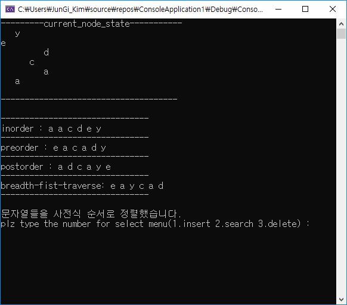

# 개요

1. Binary Search Tree 구조를 생성합니다.

2. 1번에서 구현한 것을 이용하여 문자열을 입력받아 문자열의 사전식 순서로 Binary Search Tree를 생성합니다.

3. DFS(preorder, inorder, postorder), BFS로 출력합니다.

4. BST에 대한 연산으로 insert, delete, search가 구현되어 있습니다.

5. Generic coding기법을 이용하였습니다.


## Binary Search Tree

1. left subtree에 있는 모든 Node들은 right subtree에 있는 모든 Node들보다 크기가 반드시 작아야합니다.

2. 모든 subtree는 binary tree구조 형태를 취하고 있어야 합니다.

요구되는 연산은 앞의 챕터에서 배웠던 complete binary search와 유사하지만, Node의 입력(insert)과 삭제(delete)가 다릅니다.

Node가 추가되거나 삭제될때, binary search tree의 속성을 만족해야 하기 때문입니다.


### 1. Insert

새로운 트리에 추가하게 된다면, 단순히 트리의 root에 Node를 추가하면 되지만, 1개 이상의 Node가 존재되어 있는 이진 트리에 새로운 Node를
추가해야 한다면 비교가 필요합니다.


위와 같은 이진 트리 조건을 가질 때, 새로운 노드 5을 추가하는 과정입니다.


먼저, root Node와 비교를 하게 됩니다. 새로운 Node의 값 5는 root Node보다 작으므로, 작은 값이 위치한 왼족 subtree로 탐색을 이동
합니다.
 


이번에는 4의 값을 가진 Node와 비교합니다. 추가하려는 Node의 값이 보다 크므로, 이번에는 오른쪽 subtree로 탐색을 이동합니다.


이번에는 8의 값을 가진 Node와 비교합니다. 추가하려는 Node의 값이 보다 작으므로, 이번에는 왼쪽 subtree로 이동해야합니다. 하지만 leaft
Node조건 이므로 왼쪽 Node에 새로운 Node를 추가하게됩니다.


트리의 깊이가 h라면, 연산 시간에대한 최대 boundary는 O(h)가 됩니다.


### 2. Delete

Delete연산의 경우, tree의 속성을 만족시키면서 Node의 제거가 이루어져야 합니다. 따라서 발생할 수 있는 4가지 case에 대한 delete처리는
아래와 같습니다.

<table>
<tr>
<td>

1. 삭제할 Node가 leaf Node인 경우, 단순히 leaft Node를 제거해주면 됩니다. 단, 부모 Node에서 연결되어 있던 link에 대해서는 끊어졌(Null)다는 것을 명시할 필요가 있습니다.

</td>
</tr>
<tr>
<td>

2. 삭제할 Node가 left subtree만 가지고 있는 경우 입니다. 해당 Node를 삭제하고, 삭제된 Node의 자리는 left child Node로 대체합니다.

</td>
</tr>
<tr>
<td>

3. 삭제할 Node가 right subtree만 가지고 있는 경우 입니다. 해당 Node를 삭제하고, 삭제된 Node의 자리는 right child Node로 대체합니다.

</td>
</tr>
<tr>
<td>

4. 삭제할 Node가 left subtree와 right subtree 둘 다 가지고 있는 경우 입니다. 이 경우, 삭제되는 Node의 <strong>left subtree중 가장 큰 값</strong>을 가져오거나, <strong>right subtree중 가장 작은 값</strong>이 삭제된 Node의 자리를 대체합니다.

</td>
</tr>
</table>

## Generic Coding

C에서는 함수의 파라미터와 구조체의 멤버등에 대해 타입을 명시하지 않고, void* 로 명시하여 포괄적으로 어느 자료형이든 간에 구조체에 담을 수 있거나
어느 자료형이든지 해당 함수에서 파라미터로 받거나 처리할 수 있게 하는 기법입니다. 

```c
typedef struct {
	char* data;
	struct Node* left;
	struct Node* right;
}Node;

typedef struct {
	void* data;
	struct Node* left;
	struct Node* right;
}Node;
```
위 구조체 선언을 아래와 같이 void 포인터를 이용하여 표현할 수 있습니다. 이렇게 되면, char형 데이터 뿐만 아니라, int, long, 또는 다른 사용자 정의 자료형에 대해서 모두
Node의 데이터로 가질 수 있게 됩니다.

***

## 소스코드

```c
typedef struct {
	struct Node* first;
	struct Node* end;
	struct Node* (*deqeueu)(void* argument1, void* argument2);
	struct queue* (*enqueue)(void* argument1, void* argument2);
}queue;

typedef struct {
	struct Node* element;
	struct Node* next;
}queue_elements;

typedef struct {
	char* character;
	struct Node* left;
	struct Node* right;
	void (*printing)(void* argument);
}Node;
```

Binary Tree에서와 마찬가지로, Node에 대한 구조체를 명시한 부분입니다.

여기서는 generic coding을 이용하여, queue의 멤버중에서 void함수를 받을 수 있습니다. 

마찬가지로 Node 구조체 멤버에서 void포인터 함수를 받을 수 있게 하였습니다. void 타입이기 때문에 본 과제에서는 문자열이지만, 숫자에 대해서도 추가적으로 출력할 수 있습니다. 

<br>
<br>
<br>

```c
Node* insert_Node(char* input, Node* bst, int (*cmp)(void* a, void* b)) {
	if (bst == NULL) {
		bst = (Node*)malloc(sizeof(Node)*200);
		bst->character = (char*)malloc(sizeof(char));
		strcpy(bst->character, input);
		bst->left = NULL;
		bst->right = NULL;
		bst->printing = &total_view;
		return bst;
	}
	else {
		if (cmp((bst->character), input) == 1) {
			bst->left = insert_Node(input, bst->left, cmp);
		}
		else {
			bst->right = insert_Node(input, bst->right, cmp);
		}
	}
	return bst;
}
```
Binary Search Tree구조를 유지하면서, 새로운 Node를 추가하는 함수입니다.

먼저, 비어있는 Binary Search Tree라면 단순히 Node를 추가하지만 비어있지 않다면 사전식 순서로 문자값을 비교합니다.

Node와의 비교는 recursion으로 구현하였으며 <strong>재귀의 종료조건인 bst == NULL 이 반드시 선행</strong>되어야 합니다.

비교는 사용자 정의 함수 cmp이며, 어떤 타입을 처리하는 함수든지 다 정의하면 받을 수 있게하기 위해 void 포인터형으로 파라미터를 받습니다.

<br>
<br>
<br>

```c
Node* search_and_delete(Node* bst, char* target, Node* preNode, int (*cmp)(void* a, void* b)) {

	Node* head = bst;
	Node* tmp;
	Node* target_Node;

	if (bst == NULL)return NULL;
	else {
		if (cmp(bst->character, target) == 0) {//if found the node to delete
			if (bst->left == NULL && bst->right == NULL) {
				free(bst);
				return NULL;
			}

			if (bst->left != NULL && bst->right == NULL) {
				tmp = bst->left;
				free(bst);
				bst = tmp;
				return bst;
			}

			if (bst->left == NULL && bst->right != NULL) {
				tmp = bst->right;
				free(bst);
				bst = tmp;
				return bst;
			}

			if (bst->left != NULL && bst->right != NULL) {//양쪽 node 둘다 존재하는 경우
				target_Node = bst;
				bst = bst->right;
				preNode = bst;
				if (bst->left == NULL) {//지우고자 하는 노드의 right child로 한번 이동한후
										//, 그 node의 left가 비어있다면 right subtree의 가장 작은 값은 right sbutree의 root가 됩니다.
					bst->left = target_Node->left;
					free(target_Node);
					target_Node = bst;
					return target_Node;
				}

				if (bst->left != NULL) {//지우고자 하는 노드의 right child로 한번 이동한후
										//, 그 node의 left가 있다면, 지우고자 하는 node의 right subtree의 가장 작은 값을 가지는 node를 찾습니다.
					while (bst->left != NULL) {
						preNode = bst;
						bst = bst->left;
					}
					if (bst->right != NULL) preNode->left = bst->right;//가장 작은 값을 가지는 node가 right child가 존재하는 경우 
																	   //가장 작은 값을 가지는 node의 parent node에 가장 작은 값을 가지는 node의 right child를 붙여줍니다.

					if (bst->right == NULL)preNode->left = NULL;//반대로 가장 작은 값을 가지는 node가 leaf이면
																//가장 작은값을 가지는 node의 parent node의 left에 null을 붙여줍니다.

					if (target_Node->left != NULL) bst->left = target_Node->left;//지우고자 하는 node의 left가 있다면 지우고자 하는 노드의 left subtree를
																				 //가장 작은 값의 node의 left에 붙여줍니다.

					else bst->left = NULL;//반대로 지우고자 하는 노드의 left subtree가 비어있다면, 가장 작은 값의 node의 left에 null을 붙여줍니다.

					if (target_Node->right != NULL)bst->right = target_Node->right;//지우고자 하는 node의 right의 경우또한 마찬가지입니다.
					else bst->right = NULL;
				}
			}
		}
		if (*(bst->character) > * target) {
			bst->left = search_and_delete(bst->left, target, preNode, cmp);
			return bst;
		}
		if (*(bst->character) < *target) {
			bst->right = search_and_delete(bst->right, target, preNode, cmp);
			return bst;
		}
	}
	return bst;
}
```

Binary Search Tree를 구성하는 특정 Node를 찾아서 지우는 함수입니다. 지울때, BST의 구조를 유지해야 하므로 서론 부분에서 언급한 4가지 case에 대한 처리가 if로
명시되어 있습니다.

우선, 지우려는 Node의 문자값 target을 찾는 부분은 마지막에 위치한 2개의 if문입니다. 여기서도 재귀함수로 처리하였습니다.

만약 target이 현재 Node의 문자값 보다 작다면, 왼쪽 subtree를 이 함수의 파라미터로 전달하게 됩니다. 반대로 target의 문자값이 크다면, 오른쪽 subtree를 파라미터로 넘겨주어 재귀함수를 호출합니다.

여기서 주목할만한게, 지우려는 target Node가 left, right child를 모두 가지고 있는 경우입니다. 저는 target을 가지고 있는 Node의 right subtree중 가장 작은 값을 지우려는 Node의 자리에
대체하도록 하였습니다. 또한 right subtree로 가더라도 구현할 때는 여러가지 case가 아래와 같이 존재하여, 이러한 case들에 대해 처리하도록 하였습니다.
<br>
<br>

right subtree로 갔을 때....

1. left subtree가 없는 경우

2. left subtree가 존재하고 가장 작은 값을 가지는 Node가 right child를 가지는 경우

3. left subtree가 존재하고 가장 작은 값을 가지는 Node가 leaft Node인 경우

<br>
<br>
<br>

```c
Node* search(Node* bst, char* target, int (*cmp)(void* a, void* b)) {
	if (bst == NULL)return NULL;
	else {
		if (cmp(bst->character, target)==0)return bst;
		else if (cmp(bst->character, target) ==1)search(bst->left, target, cmp);
		else search(bst->right, target, cmp);
	}
}
```
특정 target 문자 값을 가지고 있는 Node의 존재 유무를 찾아주는 search함수 입니다.

여기서도 특정 타입에만 제한되지 않고, 모든 타입에 대해서 비교나 비교 연산(함수)을 받을 수 있도록 void*포인터를 파라미터로 받습니다.

<br>
<br>
<br>

***

## 결과

c -> a -> y -> c -> a -> d 순으로 입력하는 경우 입니다.




<br>
<br>

***


삭제