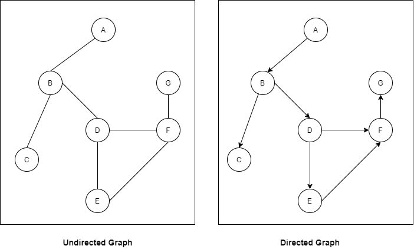
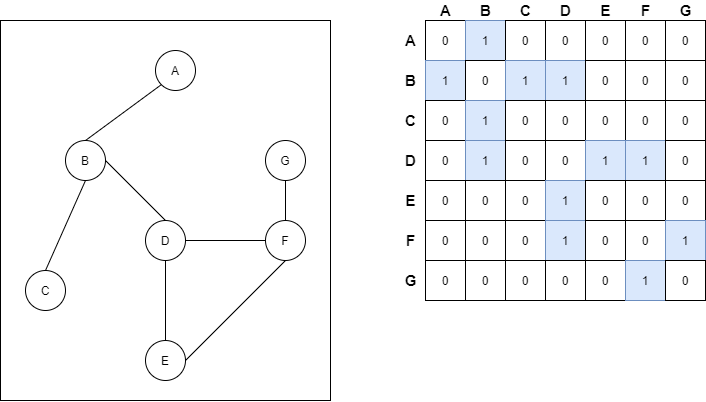
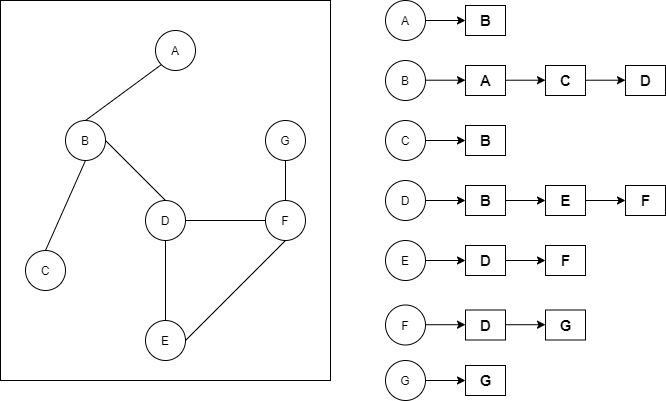
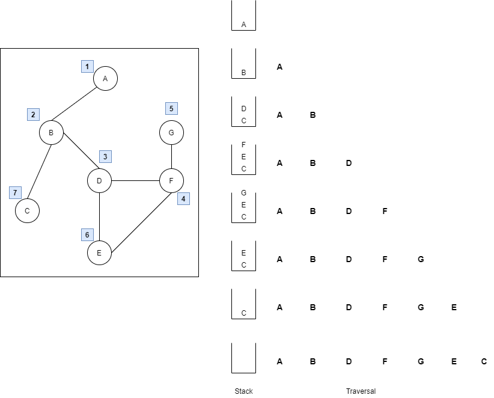
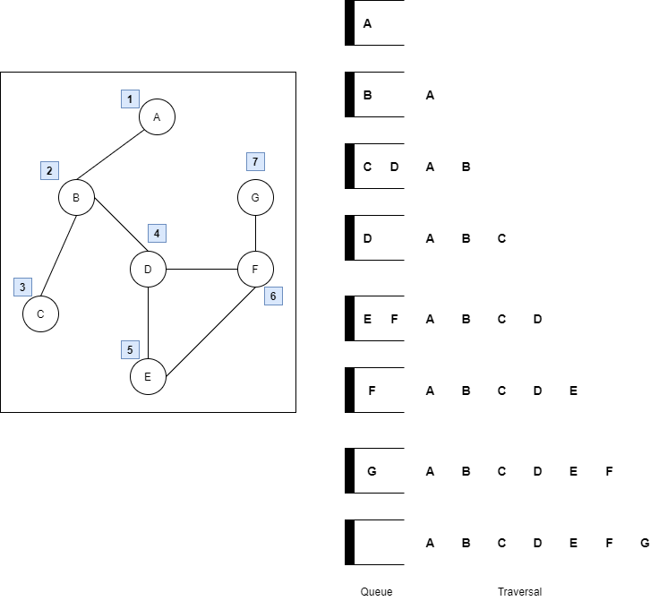

# 개요

1. Graph를 adjacency matrix와 adjacency list를 이용하여 구현합니다.

2. 1에서 구현한 것을 이용하여, input file로 부터 데이터를 입력받아 graph에 저장한 후, DFS와 BFS로 출력합니다.

3. Adjacency list에 그래프의 가중치를 추가하여 구현 해 봅니다.

4. 3에서 구현된 graph를 이용하여 특정 input파일을 받아 minimum spanning tree를 구합니다.

## Graph



 모든 node(vertex)들이 edge(arc)에 의해 연결된 형태입니다. 

1. Directed graph : 간선에 방향성이 있는 그래프로, vertex와 arc를 가집니다.

2. Undirected graph : 간선에 방향성이 없는 그래프로, node와 edge를 가집니다.

정점(node, or vertex)의 집합을 V, 간선(edge, arc)의 집합을 E라고 하면 아래와 같이 그래프를 표현할 수 있습니다.

> G = (V, E) 

Terminology

* Path : 인접한 노드로 구성된 일련의 sequence

* Cycle : 어떤 노드에서 시작해 다른 노드를 거치지 않고 바로 자기 자신 노드에서 끝나는 경로(path)

* Loop : 간선의 end point가 같은 경우

* Complete Graph : 주어진 node에 대해서 최대한의 edge를 가지는 graph

## Adjacency matrix

Graph의 node(or vertex)와 edge(arc)를 2 dimensional의 array로 나타낸 형태입니다.



## Adjacency list

Graph의 node(or vertex)와 edge(arc)를 리스트로 나타낸 형태입니다. 소스코드에서는 링크드 리스트로 구현되어 있는것을 확인할 수 있습니다.



## Graph에 대한 탐색(traversal) 방법

1. DFS

인접 node를 탐색하기 전에, 해당 node의 자식 node들을 먼저 탐색하는 방법입니다.

자식 node들을 탐색하고 나면, 부모 node로 돌아와야 하는 backtracking이 필요합니다.

backtracking은 재귀호출을 이용하거나, 스택으로 구현할 수 있습니다.



2. BFS

해당 node의 다음 level을 탐색하기 전에, 인접한 모든 vertex를 먼저 탐색하는 방법입니다.

어떤 node의 인접한 행렬들을 먼저 탐색하므로 queue를 이용하여 구현할 수 있습니다.



## Minimum spanning tree

최소 신장 트리(MST)로서, 그래프의 모든 node(or vertex)를 포함하면서 최소한의 연결(edge, or arc)을 가지고, 그 때의 간선들의 가중치(weight)의 합이 최소가 되는 subgraph입니다.

즉, 다음과 같은 condition을 만족해야 합니다.

1. n개의 정점을 가진 어떤 그래프 G가 MST가 되려면, n-1개의 간선을 가져야 합니다. 이는 트리 형태가 됨을 의미합니다.

2. 어떤 그래프 G가 MST가 되려면, simple cycle이 없어야 합니다.

이 과제에서는 Prim 알고리즘을 사용하여 구현하였습니다.


***

## 소스코드

```c
int** make_adj_matrix() {
	FILE* fp;
	fp = fopen("input.txt", "r");
	int** adj_matrix;
	int** read_matrix;
	int number_of_vertex;
	char space;
	char tmp;
	int i, j, k, l, count;

	fscanf(fp, "%d", &number_of_vertex);
	fscanf(fp, "%c", &space);
	
	read_matrix = (int**)malloc(sizeof(int) * 9);
	adj_matrix = (int**)malloc(sizeof(int)*number_of_vertex);
	
	for (i = 0; i < 9; i++) 
		*(read_matrix + i) = (int**)malloc(sizeof(int) * 2);

	for (i = 0; i < number_of_vertex; i++) 
		*(adj_matrix + i) = (int*)malloc(sizeof(int) * number_of_vertex);
	
	for (i = 0; i < number_of_vertex; i++) {
		for (j = 0; j < number_of_vertex; j++)adj_matrix[i][j] = 0;
	}

	i = 0;
	j = 0;
	while (!feof(fp)) {
		fscanf(fp, "%c", &tmp);
		read_matrix[i][j] = tmp - 'A';
		j++;
		fscanf(fp, "%c", &space);
		fscanf(fp, "%c", &tmp);
		read_matrix[i][j] = tmp - 'A';
		fscanf(fp, "%c", &space);

		i++;
		j = 0;
	}	
	for (count = 0, i = 0, j = 0, k = 0, l = 0; count < number_of_vertex; count++) {
		i = read_matrix[k][l];
		l++;
		j = read_matrix[k][l];

		adj_matrix[i][j] = 1;
		l = 0;
		k++;	
	}
	free(read_matrix);
	fclose(fp);
	return adj_matrix;
}
```
input.txt 파일로부터 그래프에 대한 인접행렬을 만드는 함수입니다.

2차원 배열을 더블 포인터로 만들었으며, index의 0부터 8까지는 순서대로 A, B, C, ... , H 노드에 대응합니다.

동적할당된 2차원 배열에 대한 모든 원소값을 0으로 초기화한다음에 파일이 끝날때 까지(feof) 문자열 하나를 읽어들입니다.

그리고 문자'A'와 해당 문자를 뺀 값을 read_matrix[][]의 원소 값으로 넣게 됩니다. read_matrix는 인접 행렬의 행과 열의 값을 담당하고, input file에 대해서는 아래와 같은 값을 가집니다.

<table>
<tr>
<td>0</td>
<td>2</td>
</tr>
<tr>
<td>0</td>
<td>1</td>
</tr>
<tr>
<td>1</td>
<td>4</td>
</tr>
<tr>
<td>1</td>
<td>3</td>
</tr>
<tr>
<td>2</td>
<td>5</td>
</tr>
<tr>
<td>4</td>
<td>6</td>
</tr>
<tr>
<td>5</td>
<td>6</td>
</tr>
<tr>
<td>6</td>
<td>7</td>
</tr>
<tr>
<td>3</td>
<td>7</td>
</tr>

</table>

이는 각행의 첫번째 열의 원소는 인접행렬의 행을, 두번째 열의 원소는 인접행렬의 열에 대응됩니다.

예를 들어, (0,2)의 경우 A와 C가 연결되어 있으므로 인접행렬(adj_matrix)의 (0, 2)에서 1값을 가지게 됩니다.

<br>
<br>
<br>

```c
GRAPH* make_adj_list_graph(int vertexNumber, int exists_weight, char* file_name) {
	//undirected graph 형성
	//exists_weight == 0 이면, 가중치가 없는 그래프
	//exists_weight == 1 이면, 가중치가 있는 그래프
	GRAPH* g;
	Vtx* ver_tmp;
	Vtx* first_ver_tmp;
	Vtx* second_ver_tmp;
	Arc* only_read;
	Arc* arc_tmp;
	char get[5];
	char* data_tmp;
	char space[1];
	FILE* fp;
	int i, j, k, count;
	int weight;

	fp = fopen(file_name, "r");
	g = (GRAPH*)malloc(sizeof(GRAPH));
	ver_tmp = (Vtx*)malloc(sizeof(Vtx) * vertexNumber);
	for (i = 0; i < vertexNumber; i++) {
		(ver_tmp + i)->next = NULL;
		data_tmp = (char*)malloc(sizeof(char));
		*data_tmp = 'A' + i;
		(ver_tmp + i)->data = data_tmp;
		(ver_tmp + i)->indegree = 0;
		(ver_tmp + i)->outdegree = 0;
		(ver_tmp + i)->flag = 0;
		(ver_tmp + i)->arc = NULL;
	}//node, 즉 vertex를 vertex개수만큼 생성합니다.
	g->first = ver_tmp;

	fgets(get, sizeof(get), fp);
	
	while (!feof(fp)) {
		fgets(get, sizeof(get), fp);
		i = get[0] - 'A';
		j = get[2] - 'A';
		if (exists_weight == 1) {
			fscanf(fp, "%d", &weight);
			fscanf(fp, "%c", &space);
		}
	
		
		first_ver_tmp = (ver_tmp + i);
		second_ver_tmp = (ver_tmp + j);
		if (first_ver_tmp->arc == NULL) {
			arc_tmp = (Arc*)malloc(sizeof(Arc));
			arc_tmp->destination = second_ver_tmp;
			arc_tmp->nextArc = NULL;
			if (exists_weight == 1)arc_tmp->weight = weight;
			first_ver_tmp->arc = arc_tmp;
		}
		else {
			//printf("done?\n\n");
			only_read = first_ver_tmp->arc;
			while (only_read->nextArc != NULL) {
				only_read = only_read->nextArc;
			}
			arc_tmp = (Arc*)malloc(sizeof(Arc));
			arc_tmp->destination = second_ver_tmp;
			arc_tmp->nextArc = NULL;
			if (exists_weight == 1)arc_tmp->weight = weight;
			only_read->nextArc = arc_tmp;
		}
		(first_ver_tmp->outdegree)++;
		
	}
	g->first = ver_tmp;
	
	//
	for (i = 0; i < vertexNumber; i++) {
		data_tmp = (ver_tmp + i)->data;
		printf("%d번째(괄호는 가중치) %c", i + 1, *data_tmp);
		first_ver_tmp = ver_tmp + i;
		if (first_ver_tmp->arc != NULL) {
			only_read = first_ver_tmp->arc;
			while (only_read != NULL) {
				second_ver_tmp = only_read->destination;
				data_tmp = second_ver_tmp->data;
				printf("-%c", *data_tmp);
				if (exists_weight == 1)printf("(%d)", only_read->weight);
				only_read = only_read->nextArc;
			}
			
		}
		printf("\n");
		
	}

	//
	fclose(fp);
	return g;
}
```
input.txt 파일로부터 인접 리스트를 만드는 행렬입니다. flag변수 exists_weight를 통해 weight가 있는 그래프와 weight가 없는 그래프 모두
인접 리스트로 표현할 수 있게 하였습니다.

먼저 그래프를 구성하고 있는 node의 개수만큼, vtx 구조체를 할당하고 초기화합니다. 즉, 노드 A, B, C, D, E, F, G, H를 가지는 vtx구조체들입니다. 현재 연결 확인은 안되어 있으므로 
모두 link가 null로 초기화 되어있습니다.

동적할당된 vtx 구조체들(ver_tmp)은 배열처럼 연속적으로 참조할 수 있습니다. 이를 이용해, read_matrix때와 마찬가지로 vtx 구조체 배열에 인덱스를 더함으로써 arc를 생성할 수 있습니다.

arc 생성에 대한 구체적인 로직은, input의 일부분을 가져와 예시를 들겠습니다.

<table>
<tr>
<td>A</td>
<td>C</td>
</tr>
<tr>
<td>A</td>
<td>B</td>
</tr>
<tr>
<td>B</td>
<td>E</td>
</tr>
</table>

<br>
<br>

<table>
<tr><td>
현재 처음으로 arc의 연결을 확인하므로, 모든 node들은 아직 arc를 가지고 있지 않습니다.
첫번째 행에서 A와 C가 연결되어 있습니다. 따라서 A node가 참조 되면, A node의 arc를 만든다음 C node에 link를 연결해줍니다.
</td></tr>
<tr><td>
다음 행으로 넘어가서, A와 B가 연결되어 있고, A가 더이상 null link(arc)가 아닙니다. 이는 A가 위에서 C와 이미 arc로 연결되어 있음을 의미합니다.
따라서 링크드 리스트의 탐색처럼, arc가 가리키는 다음이 null이 나올 때까지 검색을 하게됩니다. 여기서는 C에 연결된 arc가 마지막 arc이므로
해당 arc의 destination를 B로 link하게 됩니다.
</td></tr>
<tr><td>
마지막으로 B와 E의 연결입니다. node B의 경우, link(arc)가 아직 null이므로 arc를 새로 동적할당하고 arc가 가리키는 목적지를 Node E로 합니다.
</td></tr>
</table>

<br>
<br>
<br>

```
void print_BFT_list(GRAPH* g, int vertex) {
	int i, j, k;
	QUEUE* q;
	char* read;
	Arc* arc_tmp;
	Vtx* tmp = g->first;//개개의 vertex는 행렬로 생각하면 됨.
	q = (QUEUE*)malloc(sizeof(QUEUE));
	q->end = NULL;
	q->first = NULL;
	
	//vertex자체를 큐에 저장
	ENQ(q, (tmp + vertex));
	(tmp + vertex)->flag = 1;
	
	while (q->size != 0) {
		tmp = DEQ(q);//vertex자체를 return
		read = tmp->data;
		printf("%c ", *read);
	
		arc_tmp = tmp->arc;
		while (arc_tmp != NULL) {//arc 간선에 연결되어있는 노드, or vertex를 큐에 저장
			tmp = arc_tmp->destination;
			if (tmp->flag == 1) {
				arc_tmp = arc_tmp->nextArc;
				continue;
			}
			ENQ(q, arc_tmp->destination);
			tmp->flag = 1;
			arc_tmp = arc_tmp->nextArc;
		}
	}

	tmp = g->first;
	for (i = 0; i < 8; i++) {
		(tmp + i)->flag = 0;
	}//출력이 끝나면 다시 flag 초기화	
}
```


```c
void print_DFT_list(GRAPH* g, int vertex) {
	//pop 하고 난 다음에 바로 출력
	int i;
	Vtx* tmp;
	Arc* arc_tmp;
	STACK* s;
	char* tmp_str;
	s = (STACK*)malloc(sizeof(STACK));
	s->size = 0;
	s->top = NULL;
	tmp = g->first;
	tmp = tmp + vertex;
	PUSH_stack(s, tmp);//vertex자체가 stack에 들어가야함.
	tmp->flag = 1;
	while (s->size != 0) {
		tmp = POP_stack(s);
		tmp_str = tmp->data;
		printf("%c ", *tmp_str);
		tmp->flag = 1;
		//arc, 간선 개수만큼 vertex를 stack 저장
		//이미 access 한적있으면 flag == 1 조건으로 점프
		arc_tmp = tmp->arc;
		while (arc_tmp != NULL) {
			tmp = arc_tmp->destination;
			if (tmp->flag == 1) {
				arc_tmp = arc_tmp->nextArc;
				continue;
			}
			
			PUSH_stack(s, tmp);
			tmp->flag = 1;
			arc_tmp = arc_tmp->nextArc;
		}
	}

	tmp = g->first;
	for (i = 0; i < 8; i++) {
		(tmp + i)->flag = 0;
	}//출력이 끝나면 다시 flag 초기화

}
```


<br>
<br>
<br>


```c
void* prim_algo(void* graph, int VtxNumber) {
	int count;
	int min_tmp;
	Vtx* min_vertex;
	Vtx* from_vertex;
	Vtx* read;
	Vtx* access;
	Vtx* access2;
	Vtx* destination;
	MST* mst1;
	Arc* arc_tmp;
	Arc* min_arc;
	VA* va_read;
	VA* vertex_with_arc;
	char* str_tmp;
	int i;
	int total = 0;


	Vtx* test;
	char* test_str;
	mst1 = (MST*)malloc(sizeof(MST));
	mst1->vertex = (Vtx**)malloc(sizeof(Vtx)*VtxNumber);
	vertex_with_arc = (VA*)malloc(sizeof(VA)*(VtxNumber -1 ));
	mst1->number_of_vertex = 0;
	
	read = ((GRAPH*)graph)->first;

	*(mst1->vertex) = read;
	++(mst1->number_of_vertex);
	read->flag = 1;

	while (mst1->number_of_vertex < VtxNumber) {
		count = 0;
		min_tmp = 999999; 
		from_vertex = NULL;

		//MST에서 최저 weight를 가진 arc와 연결된 vertex(아직 연결되지 않은) 찾기
		while (count < mst1->number_of_vertex) {
			read = *(mst1->vertex + count);
			arc_tmp = read->arc;
			
			//destination = arc_tmp->destination;
			while (arc_tmp != NULL) {
				destination = arc_tmp->destination;
				if (arc_tmp->weight < min_tmp && destination->flag == 0) {
					min_tmp = arc_tmp->weight;
					min_arc = arc_tmp;
					from_vertex = read;
				}
				arc_tmp = arc_tmp->nextArc;
				
				
			}
			count++;
		}
		*(mst1->vertex + count) = min_arc->destination;

		test = from_vertex;
		test_str = test->data;
		printf("%c-",*test_str);

		test = min_arc->destination;
		test_str = test->data;
		printf("%c\n", *test_str);

		access = min_arc->destination;
		access->flag = 1;
		
		access = *(mst1->vertex +(count - 1));

		access = from_vertex;
		
		++(mst1->number_of_vertex);
		
	}

}
```

Prime 알고리즘을 이용하여, 최소 신장 트리를 찾는 함수입니다.

## 결과