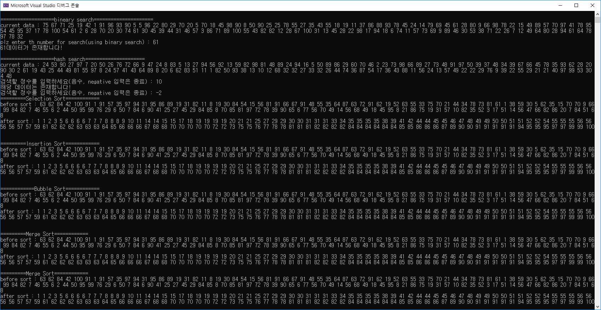

# 개요

1. Binary search와 hashed search를 구현합니다.

2. Hash의 경우, collision 발생 시 chaining으로 해결하였습니다.

3. Selection sorting, Insertion sorting, Bubble sorting, Merge sorting, Quick sorting을 구현합니다.

4. 처리할 데이터는 1에서 부터 100사이의 랜덤한 값을 가지는 원소들이 100에서 150개 사이의 랜덤한 사이즈를 가지는 데이터입니다.

## Sorting

1. Insertion sorting

정렬된 sublist와 정렬이 되지 않은 sublist로 나누고, wall 이라는 개념을 이용하여 둘을 구분합니다.

정렬되지 않은 sublist의 첫번째 원소를 정렬된 sublist에 들어갈 알맞은 자리(index)를 찾은 후, 해당 자리 이후에 위치하는 원소들을 한칸 씩 밀어서 자리를 확보합니다.
(wall이 한칸씩 밀린다고 생각)

2. Selection sorting

마찬가지로 정렬된 sublist와 정렬이 되지 않은 sublist로 나누고, wall 이라는 개념을 이용하여 둘을 구분합니다.

오름 차순으로 정렬한다면, 정렬이 되지 않은 sublist에서 가장 작은 값을 가져와 정렬되지 않은 sublist의 첫번째 원소와 swap하고 wall을 한 칸씩 밀어 정렬된 sublist에 포함하게 합니다.
 
3. Bubble sorting

인접한 두개의 원소를 비교하여 swap하는 방식으로 정렬하는 방법입니다.

오름차순으로 정렬한다면, 인접한 두 원소를 비교할 때 작은개 왼쪽에 위치하도록 합니다.

4. Merge sorting

전체 원소를 한개의 원소로 <strong>분할한 후(divide)</strong>, 분할 된 원소들을 다시 <strong>병합(merge)하면서 정렬</strong>하는 방법입니다.

quick sorting과 더불어서, 하나의 큰 문제(전체 정렬 되지 않은 데이터)를 잘게 나누어서, 나누어진 작은 문제들을 각각 해결하는 <strong>분할정복 알고리즘</strong>입니다. 

아래 소스코드에서는 recursion으로 구현하였습니다.

5. Quick sorting

정렬되지 않은 list에서 pivot하나를 고르고, 해당 pivot을 기준으로 대소 비교를 하여 작은값은 pivot의 왼쪽에, 큰 값은 pivot의 오른쪽에 넣는 partition과정을 
pivot을 제외한 모든 원소가 정렬될때 까지 수행합니다.


***

## Search

* Binary search

정렬된 list내에서 어떤 data(target)를 찾을 때, 범위를 반씩 줄여가면서 탐색하는 방법입니다.

1. target과 list내의 중간에 위치한 원소(middle)와 비교합니다.

2-1. middle 원소보다 작다면, list의 왼쪽 sublist에 위치하므로 현재 middle(old)원소가 upper bound가 되고, new middle은 (old middle)/2 가 됩니다.

2-2. middle 원소보다 크다면, list의 오른쪽 sublist에 위차하므로 현재 middle(old)원소가 lower bound가 되고, new middle은 (upper bound - old middle)/2 가 됩니다.

3. 위 과정을 target 원소를 찾을 때까지, 또는 더 이상 비교할 수 있는 원소가 없을 때까지 반복합니다.

* Hashed search

어떤 원소(data)의 key값을 hash function을 이용하여 data의 위치와 mapping시킵니다. 따라서 이 key를 이용하여, 해당 target data의 위치(address)를 찾는 자료구조입니다.  

Hash 구조를 생성할 때, 동일한 key값을 가질 수 있는 경우 충돌이 발생(collision)할 수 있습니다. 이러한 충돌을 여러 방법으로 해결할 수 있는데 저는 hash구조를 링크드 리스트로 구현하므로
chaining을 이용하여 해결하였습니다.

***

## 소스 코드

```c
void insertion_sort(void* data, int number) {
	int* dup_data;
	int min_data;
	int min_index;
	int tmp_value;
	int i, j;
	dup_data = (int*)malloc(sizeof(int) * number);
	memcpy(dup_data, data, sizeof(int) * number);
	printf("=========Insertion Sort============\n");
	printf("before sort : ");
	print_data(dup_data, number);

	for (i = 0; i < number; i++) {
		tmp_value = dup_data[i];
		min_index = i;
		for (j = i - 1; j >= 0; j--) {
			if (tmp_value > dup_data[j]) {//주)dup_data[i] > dup_data[j] 아님, dup_data[i]는 dup_data[j + 1] = dup_data[j]때문에 바뀜.
				min_index = j + 1;
				break;
			}//넣을 공간 발견
			else {
				dup_data[j + 1] = dup_data[j];//한칸씩 밀기
				min_index = j;
			}
			
		}
		dup_data[min_index] = tmp_value;
	
	}
	printf("after sort : ");
	print_data(dup_data, number);
	delete_data(dup_data, number);
	
}
```
삽입 정렬을 이용하여 오름차순으로 정렬하는 함수입니다. generic coding을 이용하여 void 포인터를 파라미터로 받기 때문에 숫자, 또는 문자가 들어와도 정렬할 수 있습니다.

정렬이 실질적으로 이루어지는 부분은 반복문입니다. 먼저 i번째 원소 값(정렬되지 않은 sublist에 위치)을 가져와 i-1에서부터 0번째까지 원소들(정렬된 sublist에 위치)과
 크기를 비교합니다. 만약 넣을 위치를 아직 발견하지 못했다면, 원소들의 값이 보다 큰 값을 가지고 있다는뜻입니다. 따라서 한칸씩 밀게 됩니다. 반면에 원소들중에서 보다 작은 값의
 위치가 처음으로 발견이 되면 임시 변수(tmp_value)에 넣어두었던 값을 대입합니다.

<br>
<br>
<br>

```c
void selection_sort(void* data, int number) {
	int* dup_data;
	int min_data;
	int min_index;
	int tmp_value;
	int i, j;
	dup_data = (int*)malloc(sizeof(int) * number);
	memcpy(dup_data, data, sizeof(int) * number);
	printf("=========Selection Sort============\n");
	printf("before sort : ");
	print_data(dup_data, number);

	for (i = 0; i < number - 1; i++) {
		min_index = i;
		min_data = dup_data[i];
		for (j = i+ 1; j < number; j++) {
			if (min_data > dup_data[j]) {
				min_data = dup_data[j];
				min_index = j;
			}//최소값, 그에 해당하는 index찾기
		}
		tmp_value = dup_data[i];
		dup_data[i] = dup_data[min_index];
		dup_data[min_index] = tmp_value;
	}//값 교환하기

	printf("after sort : ");
	print_data(dup_data, number);


	delete_data(dup_data, number);
}
```
선택 정렬을 이용하여 오름차순으로 정렬하는 함수입니다. 배열의 0번째 index부터 시작하여 마지막 index까지 위치한 값을 기준(min_data)으로 하여 가장 작은 원소값과 위치를
교환합니다.(swap)

여기서는 swap이 필요하므로, 임시변수(tmp_value)를 이용합니다.


<br>
<br>
<br>

```c
void bubble_sort(void* data, int number) {
	int* dup_data;
	int min_data;
	int min_index;
	int tmp_value;
	int i, j;
	dup_data = (int*)malloc(sizeof(int) * number);
	memcpy(dup_data, data, sizeof(int) * number);
	printf("============Bubble Sort============\n");
	printf("before sort : ");
	print_data(dup_data, number);

	for (i = 0; i < number - 1; i++) {
		for (j = number - 1; j > i; j--) {
			if (dup_data[j - 1] > dup_data[j]) {
				tmp_value = dup_data[j - 1];
				dup_data[j - 1] = dup_data[j];
				dup_data[j] = tmp_value;
			}//bubble
		}
	}//flow
	printf("after sort : ");
	print_data(dup_data, number);
	delete_data(dup_data, number);
}
```
버블 정렬을 이용하여 오름차순으로 정렬하는 함수입니다. 배열의 index = 0에서부터 배열의 end - 1 index까지 인접한 원소들의 크기를 비교하면서, 큰 원소가 오른쪽으로 가도록 하여 
물결이 일렁이듯이 정렬하게 됩니다.

마찬가지로, bubbling을 할 때마다 swap이 일어나므로 임시변수(tmp_value)가 필요합니다.

<br>
<br>
<br>

```c
void merge_sort(void* sorted, void* data, int left, int right) {

	if (left < right) {//recursion을 중단시킬 조건문
		merge_sort(sorted, data, left, (left + right) / 2);
		merge_sort(sorted, data, (left + right )/ 2 + 1, right);
		merge(sorted, data, left, right);
	}

}
```

오름 차순으로 정렬하는 Merge sort에서 분할을 담당하는 부분입니다. 반으로 나눌 수 있는 조건이라면 재귀를 통해 정렬되지 않은 리스트를 부분적으로 1/2씩 나누게 됩니다.

주의할점은 재귀 함수이기때문에, <strong>반드시 종료조건이 로직에서 먼저 선행되어야 합니다.</strong>

<br>
<br>
<br>

```c
void merge(int* sorted, int* data, int left, int right) {
	int mid;
	int sub_left, sub_right, sorted_index;
	int i, j, k;
	mid = (right + left) / 2;
	sub_left = left;
	sub_right = mid + 1;
	sorted_index = left;


	while (sub_left <= mid && sub_right <= right) {
		if (data[sub_left] < data[sub_right]) {
			sorted[sorted_index++] = data[sub_left++];
		}
		else {
			sorted[sorted_index++] = data[sub_right++];
		}
	}
	if (sub_left <= mid) 
		for(;sub_left<=mid;sub_left++)sorted[sorted_index++] = data[sub_left];

	if(sub_right <= right)
		for(;sub_right<=right;sub_right++)sorted[sorted_index++] = data[sub_right];

	for (i = left; i <= right; i++)data[i] = sorted[i];
	

}
```
Merge sorting에서 위에서 분할된 리스트들에 대해 정렬하면서 합병(combine)하는 함수입니다. 정렬되면서 합명이 되므로, 원본 data(int *data)와 크기가
똑같으면서 정렬된 원소들이 담길(int *sorted) 배열 공간이 필요합니다.

<br>
<br>
<br>

```c
void quick_sort(int* data, int left, int right) {
	int pivot;
	if(left <= right) {
		pivot = partition(data, left, right);
		quick_sort(data, left, pivot - 1);
		quick_sort(data, pivot + 1, right);
	}
}
```

<br>
<br>
<br>

```c
int partition(int* data, int left, int right) {
	int pivot = left;
	int sub_left;
	int tmp_value;
	int sub_right;
	int target_index;
	target_index = left;
	sub_left = left + 1;
	sub_right = right;

	while (sub_left <= sub_right) {
		while (data[pivot] >= data[sub_left] && sub_left <= right){
			sub_left++;
		}
		while (data[pivot] <= data[sub_right] && sub_right >= (left + 1)){
			sub_right--;
		}
		if (sub_left <= sub_right){
			tmp_value = data[sub_left];
			data[sub_left] = data[sub_right];
			data[sub_right] = tmp_value;
		}
	}
	tmp_value = data[left];
	data[left] = data[sub_right];
	data[sub_right] = tmp_value;
	return sub_right;
}
```

<br>
<br>
<br>

```c
void bin_search(int* data, int number, int target_data) {
	int left, right, mid;
	left = 0;
	right = number;
	while (left <= right) {
		mid = (right + left) / 2;
		if (data[mid] > target_data) {
			right = mid-1;
		}
		else if (data[mid] < target_data) {
			left = mid + 1;
		}
		else {
			printf("%d데이터가 존재합니다!\n", target_data);
			return;
		}

	}
	printf("data가 존재하지 않습니다!\n");
}
```

<br>
<br>
<br>

```c
int hashing(int data) {
	return (data << 2) % max_table;
}

void push_hash(hash_elements* table, int* data) {
	int index;
	hash_elements* read;
	hash_elements* new_hash;
	int i, j;
	index = hashing(*data);
	read = table + index;
	if (read->value == *data) {//index가 중복되는 경우, 즉 colision이 발생한 경우
		while (read->next != NULL)read = read->next;
		new_hash = (hash_elements*)malloc(sizeof(hash_elements));
		new_hash->value = *data;
		new_hash->next = NULL;
		read->next = new_hash;
	}
	else {
		table[index].value = *data;

	}
}
```

<br>
<br>
<br>

```c
void hash_problem(int* data, int num) {//num은 데이터 개수
	hash_elements* table;
	int i, j, k;
	int keyboard_sel;
	table = (hash_elements*)malloc(sizeof(hash_elements) * max_table);
	for (i = 0; i < max_table; i++) {
		table[i].value = 0;
		table[i].next = NULL;
	}//table initialize

	for (i = 0; i < num; i++) {
		push_hash(table, &data[i]);
	}
	while (1) {
		printf("검색할 정수를 입력하세요(음수, negative 입력은 종료) : ");
		scanf("%d", &keyboard_sel);
		if (keyboard_sel <= -1)break;
		else find_item(table, keyboard_sel);
	}


}

void find_item(hash_elements* table, int data) {
	int index;
	index = hashing(data);
	if (table[index].value == data)printf("해당 데이터는 존재합니다!\n");
	else printf("해당 데이터는 존재하지 않습니다!\n");
}
```

<br>
<br>
<br>


***

## 결과



***

## 출처

Merge sort : 

Quick sort : https://ko.wikipedia.org/wiki/%ED%80%B5_%EC%A0%95%EB%A0%AC , PPT 강의 자료

