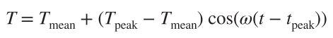
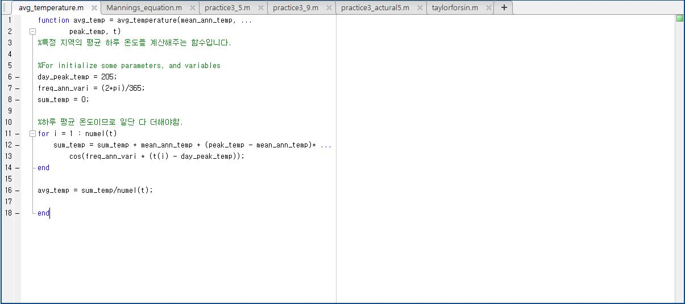
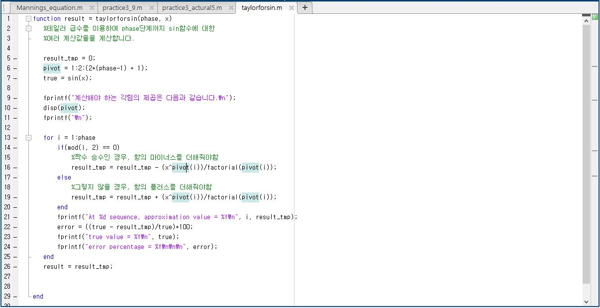
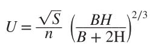
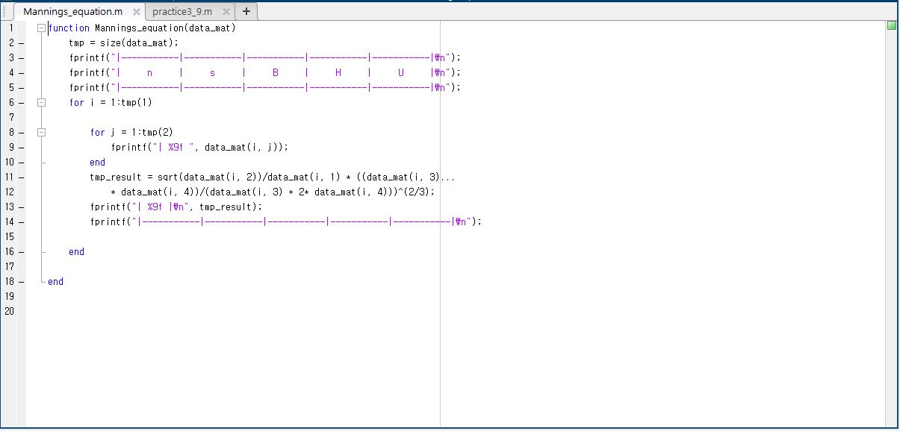
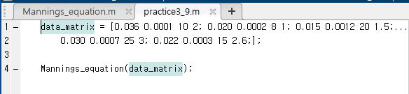
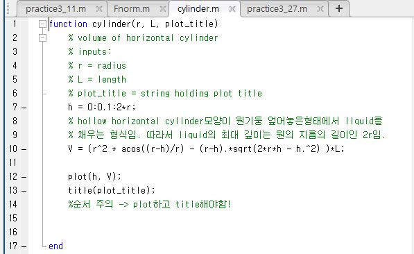
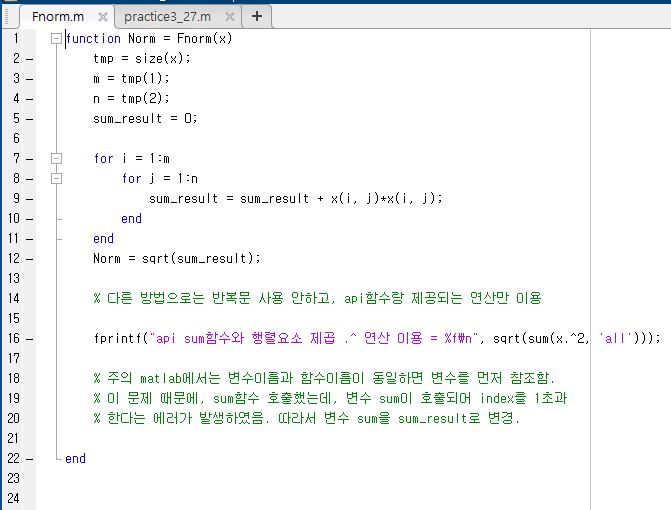
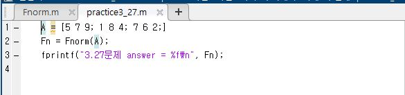

## avg_temperature.m and practice3_4.m

특정 지역의 평균 하루 온도를 아래 수식을 이용하여 (1)January-February in Yuma, AZ와 (2)
July-August in Seattle, WA에서의 온도를 계산하는 3.4절 문제입니다.

***

## taylorforsin.m and practice3_actural5.m

테일러 급수를 이용하여, Sine function을 계산하는 문제입니다.

term을 얼마나 추가하느냐에 따라서 true value와 차이가(error) 발생하는 것을 확인할 수 있습니다.

해당 문제에서는 최대 8개의 term까지 계산하여, sin(0.9)를 계산하고 실제값과 얼마나 차이나는지 approximation error를 계산합니다.

***

## Mannings_equation.m and practice3_9.m

Manning's equation을 이용하여 주어진 data에 대해 유속(velocity of water)을 계산하는 코드입니다.

***

## cylinder.m and practice3_11.m

Hollow horizontal cylinder 모양의 원기둥을 엎어놓은 형태에서 liquid를 채울때 volume을 구하는 코드입니다.

***

## Fnorm.m and practice3_27.m

해당 norm을 매트랩 m파일로 작성하여 'A' matrix에 대해 계산하는 코드입니다.

