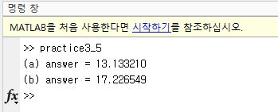
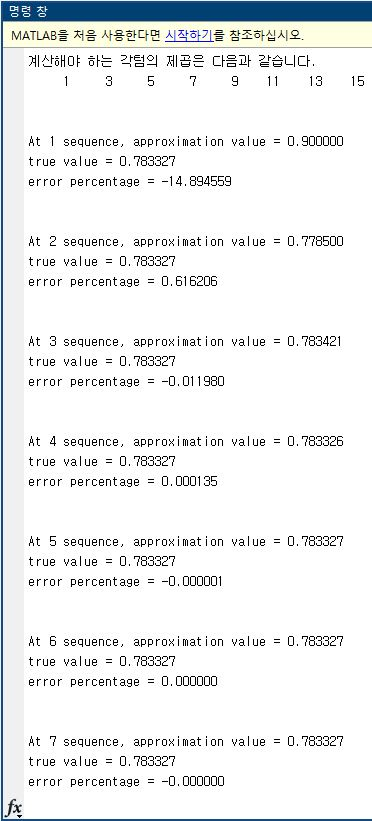
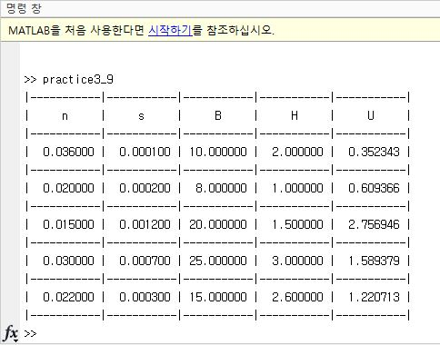
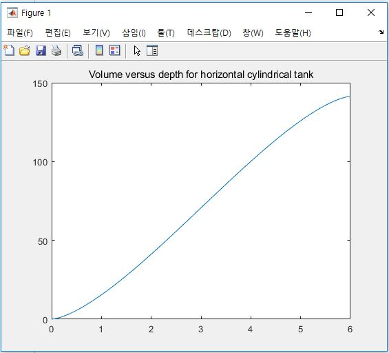
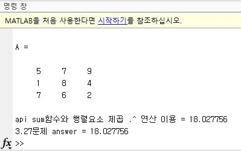

## avg_temperature.m and practice3_5.m

특정 지역의 평균 하루 온도를 계산하는 3.5절 문제입니다.

## taylorforsin.m and practice3_actural5.m

테일러 급수를 이용하여, term을 얼마만큼 사용하냐에 따라 실제값과의 오차를 비교해보는 코드입니다.

## Mannings_equation.m and practice3_9.m

Manning's 방정식을 계산하는 코드입니다.

## cylinder.m and practice3_11.m

Hollow horizontal cylinder 모양의 원기둥을 엎어놓은 형태에서 liquid를 채울때 volume을 구하는 코드입니다.

## Fnorm.m and practice3_27.m

