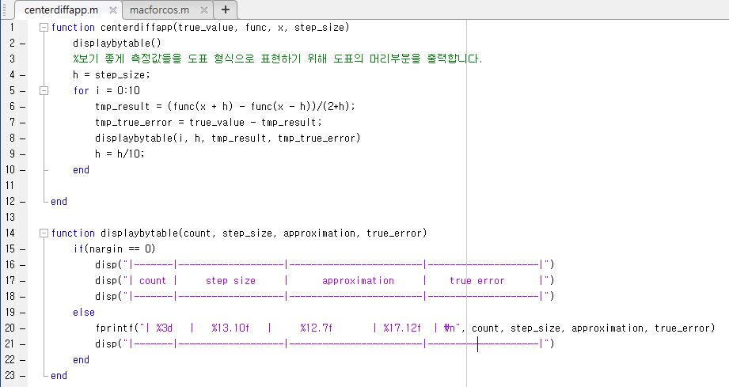
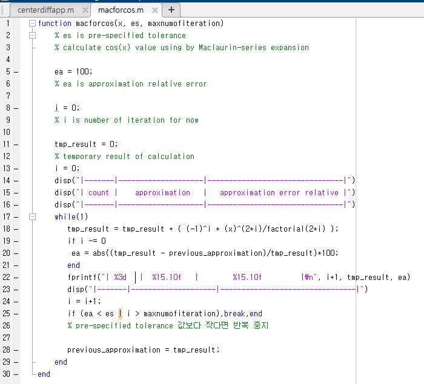

## centerdiffapp.m

Cos 함수를 Centered Difference에 대한 계산을 수행할 때, step size를 다르게 하면 실제값과의 차이가 얼마나 나는지(true error)
에 대한 approxmation relative error를 보는 코드입니다.

Step size를 1/10씩 줄여가면서 truncation error와 round-off error를 확인합니다.

Step size를 줄일수록, truncation error가 감소하여 true error가 감사하다가 어느 순간 표현해야 하는 수의 정밀도에 대한 요구량이 많아져 반대로 round-off error가 증가하므로써
true error가 증가하는 것을 확인할 수 있습니다.

*** 

## macforcos.m

맥클로린 급수를 이용하여 pi/3와 pi/7에서 Cos함수 값을 계산하는데, truncation error에 대한 영향을 보기 위해 
term이 늘어날때마다 실제값과의 차이가 얼마정도 나는지에 대한 approxmation relative 
error를 측정하는 코드입니다.

