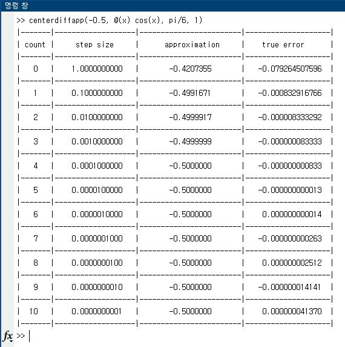
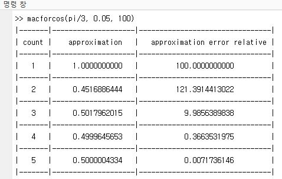
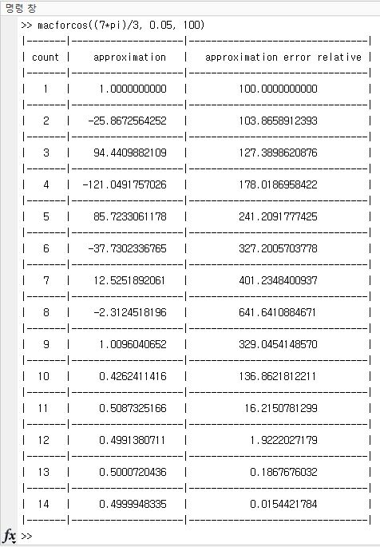

## centerdiffapp.m

Cos 함수를 Centered Difference에 대한 계산을 수행할 때, step size를 다르게 하면 실제값과의 차이가 얼마나 나는지(true error)
에 대한 approxmation relative error를 보는 코드입니다.

## macforcos.m

맥클로린 급수를 이용하여 Cos함수 값을 계산하는데, term이 늘어날때마다 실제값과의 차이가 얼마정도 나는지에 대한 approxmation relative 
error를 측정하는 코드입니다.

