# Newton Rapson method, Optimization

## Newton_Rapson.m

최고차항이 3차인 polynomial에 대해서, Newton Rapson method를 이용하여 근(root)을 찾는 문제입니다.

반복적인(iterative)방법을 이용하기 때문에, 먼저 정해둔 pre-specified limit(es)까지 반복을 하거나 최대 반복횟수(maxit)까지
계산을 수행합니다.

초기 위치(x0)는 3.5에서 시작합니다.

마지막은 Newton Rapson method을 이용하여 매트랩에서 제공하는 roots() 함수를 이용하여 해를 찾습니다.

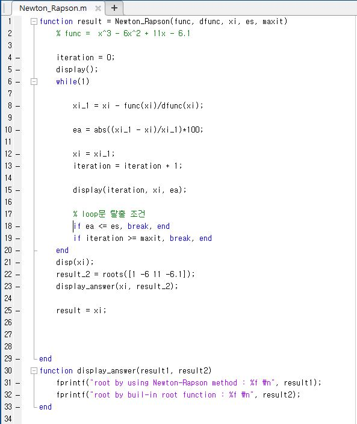

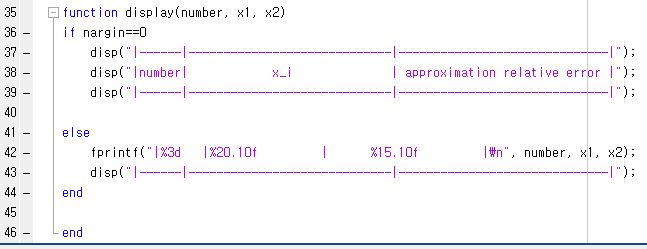

아래는 최고차항이 4차인 polynomial에 대해 초기값(x0)이 16.15일 때 x가 15와 20사이의 해를 구했을때의 결과입니다.

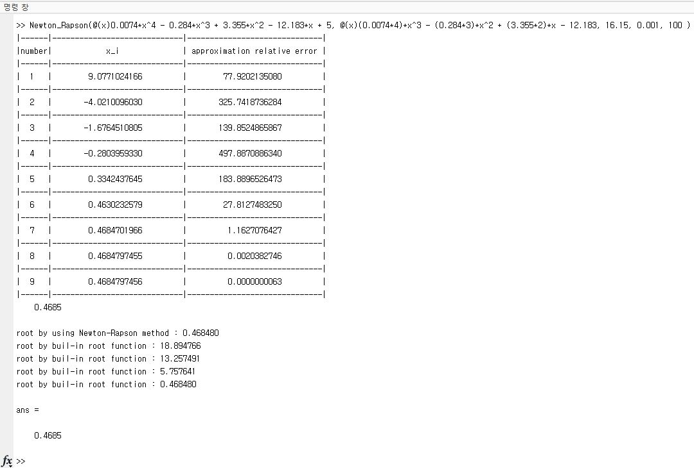

***

## impedence.m

저항, 인덕터, 커패시터가 병렬로 연결된 RLC회로에서 키르히호프 법칙을 이용하여 아래와 같은식으로 각 소자들의 관계식이 주어질때 
임피던스(Z)를 구하는 코드입니다.

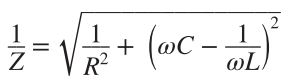

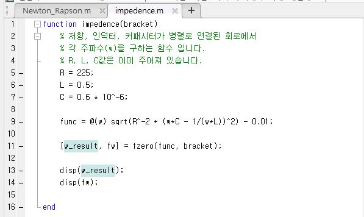

***

## optimizationfunc.m

아래와 같은 수식이 주어졌을 때, 최소값(optimization)을 찾는 코드입니다.

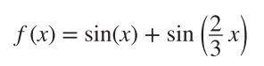

먼저 그래프를 plot해보고 매트랩 함수 fminbnd()이용하여 최소값을 찾고, 두번째로 golden section search를 직접 구현하여 
최소값을 찾는 코드입니다.

최소값을 찾을 때 구간은 [4, 8]입니다.  

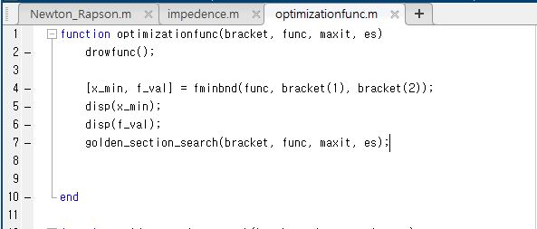

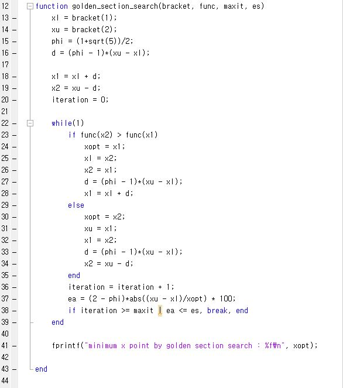

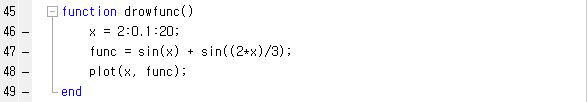

***

## deflection.m

Deflection of a uniform beam에 대해 아래와 같은 수식이 주어지고, L, E, I, W0가 주어질 때 최대가 되는 maximum point와 
그때의 함수값을 계산하는 코드입니다.

Optimization이 global또는 local의 minimu을 찾는 문제이므로, maximum을 찾기 위해서는 원 함수에 마이너스를 곱해서 함수를 뒤집은 다음 최소화를 찾으면 
최대값을 찾는 문제가 되므로 식에 마이너스를 곱해줍니다.

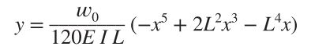

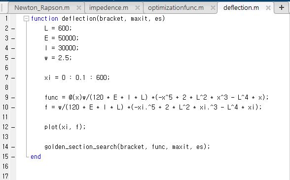

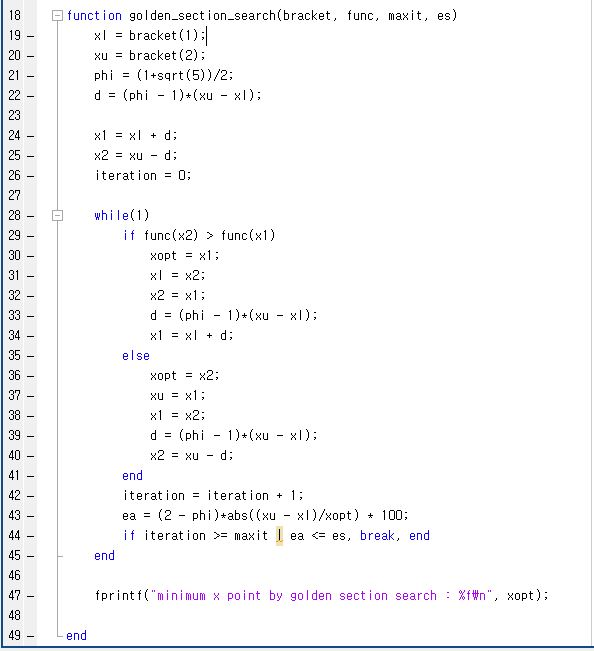

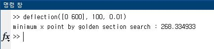

***

## charge.m

반지름이 a인 링모양의 도체에 균등하게 분포하고 있는 총 전하량 Q가 아래와 같이 주어질때, 전하 Q에 가해지는 힘이 최대가 되는 지점과 그 때의 값을 구하는 문제입니다.

마찬가지로 최대값을 구할때는 최소값을 구할때에 마이너를 곱해서 찾으면 됩니다.

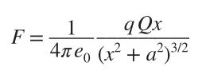

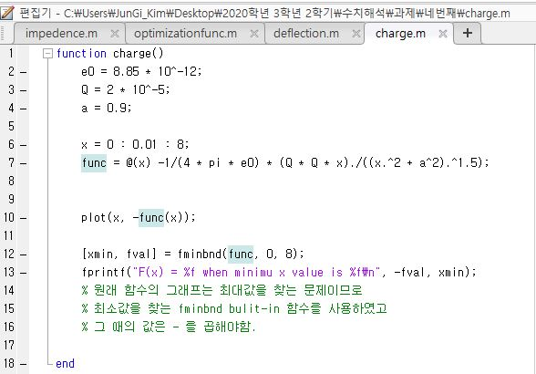

