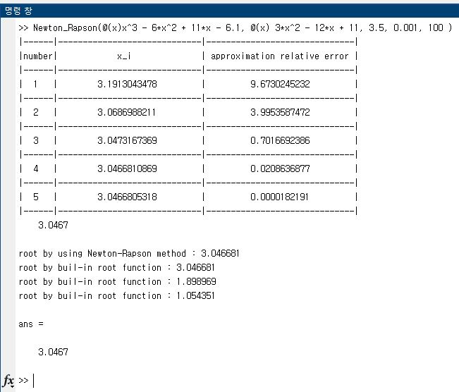
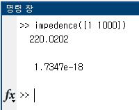
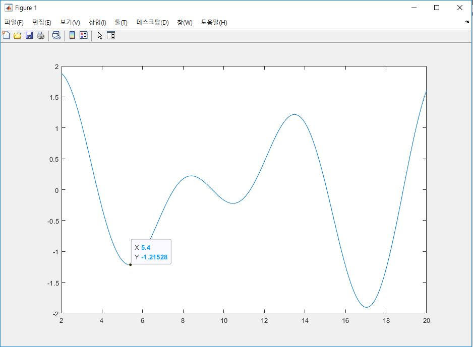
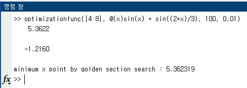
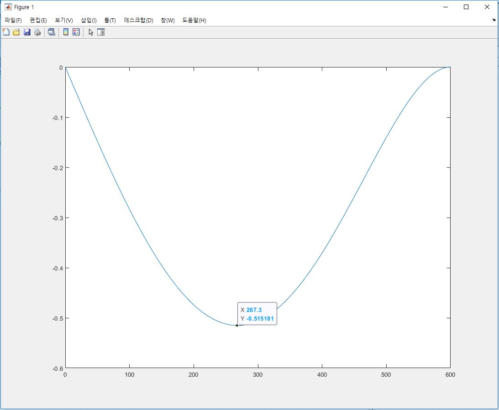
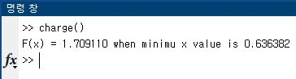
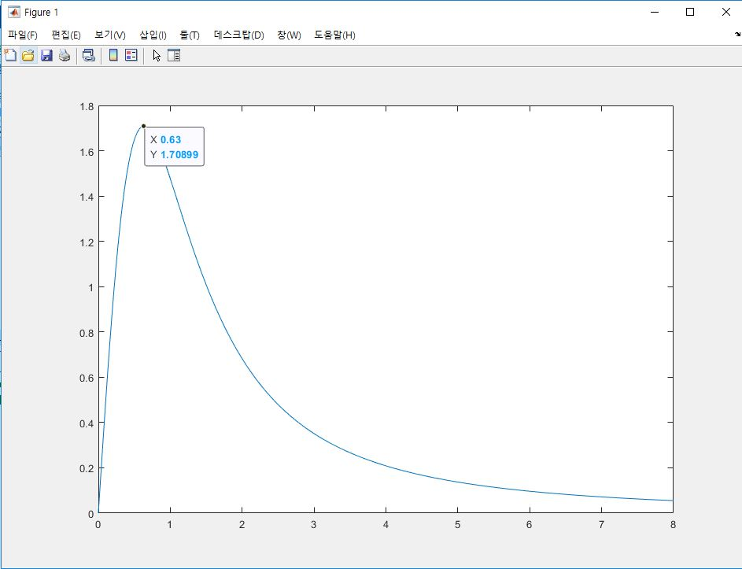

## Newton_Rapson.m

최고차항이 3차인 polynomial에 대해서, Newton Rapson method를 이용하여 근(root)을 찾는 문제입니다.

반복적인(iterative)방법을 이용하기 때문에, 먼저 정해둔 pre-specified limit(es)까지 반복을 하거나 최대 반복횟수(maxit)까지
계산을 수행합니다.

## impedence.m

저항, 인덕터, 커패시터가 병렬로 연결된 RLC회로에서 각(angular) 주파수를 구하는 함수입니다.

## optimizationfunc.m

## deflection.m

## charge.m

