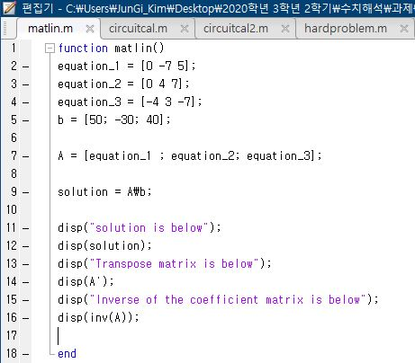
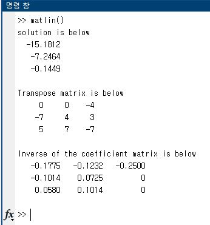
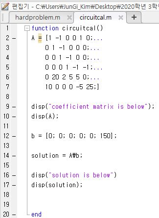
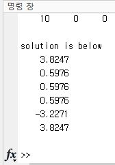
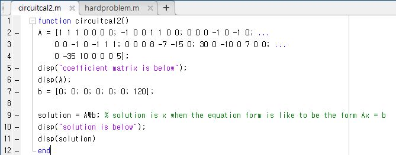
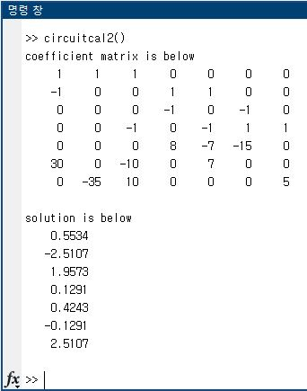
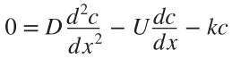
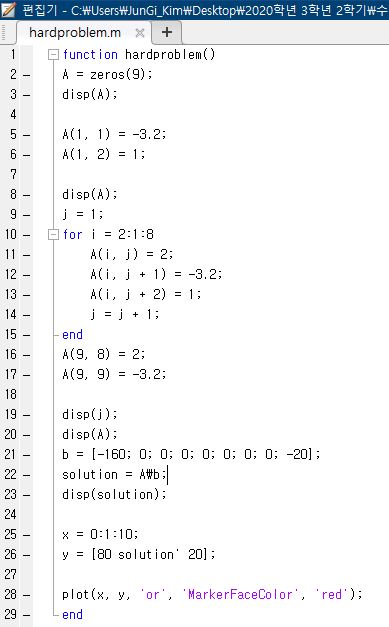
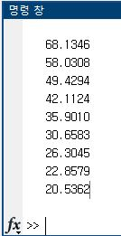
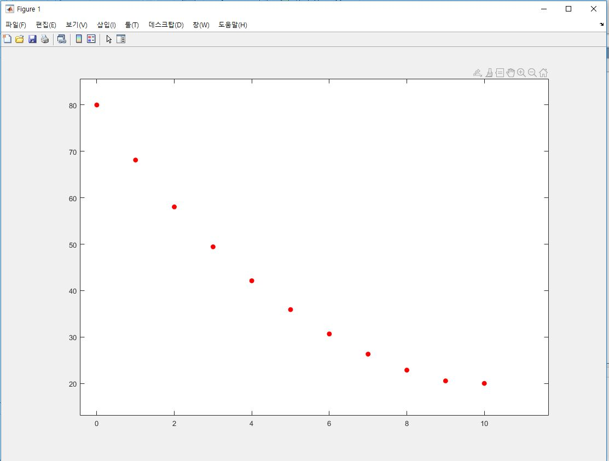

# Linear Algebra

## matlin.m

주어진 linear system에 대해 해 x1, x2, x3, transpose행렬, 역행렬을 구하는 코드입니다.

***

## circuitcal.m 

주어진 회로도에 대해, KCL과 KVL을 이용하여 선형 방정식을 세우고 매트랩을 이용하여 해(전류)를 구하는 코드입니다.

***

## circuitcal2.m

마찬가지로 주어진 회로도에 대해, KCL과 KVL을 이용하여 선형 방정식을 세우고 매트랩을 이용하여 해(전류)를 구하는 코드입니다.

***

## hardproblem.m

미분 방정식을 선형 대수를 이용하여 해결하는 문제입니다.

위와 같은 steady-state mass balance ofr a chemical in a one-dimensional canal에 대한 수식과 D, U, k, C(0), C(10)값이
주어질때 x=0에서부터 10까지 미분방정식의 해를 구하고 x축을 거리로 하여 그래프를 plot 하는 코드입니다.

