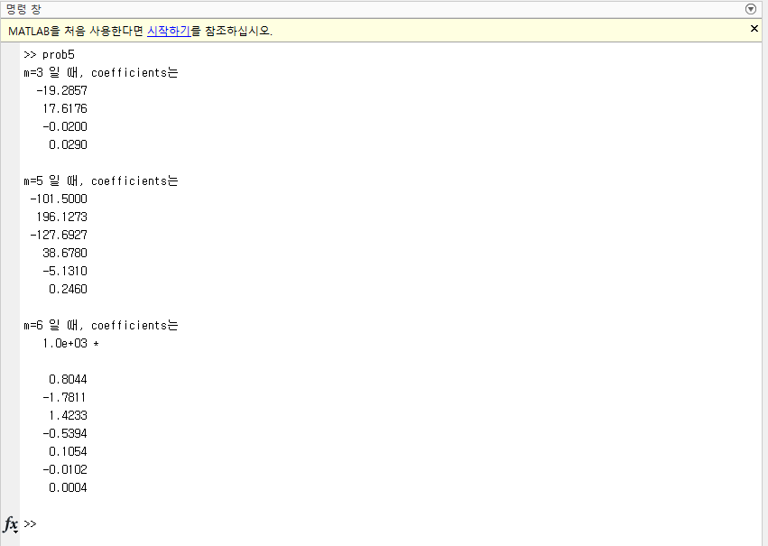

# Linear Regression and Nonlinear Regression

## prob1.m

Fitting에 관한 문제입니다.

주어진 데이터에 대해 linear model y = a0 + a1x에 fitting하는데 sum of square error를 계산하고 a0와 a1에 대해 미분하여 0이 나오도록 한다음 정리하여 나온
연립 방정식을 이용하여 계산하는 방법과 pesudo inverse를 이용하여 구하는 방법 둘다 구현하였습니다.

마지막으로 control.m 파일에서 a0, a1, 그리고 구한 계수가 얼마나 fitting이 잘되어있는지에 대한 척도 coefficient of determination을 출력합니다.

***

## prob2.m

이번에는 exponential model에 대해 fitting하는 코드입니다.

우선 선형화한다음, prob1.m에서와 같이 연립방정식을 이용하는 방법과 pseudo inverse를 이용하는 방법 둘다 구현하였습니다.

마찬가지로 control.m 파일에서 a, b, 그리고 구한 계수가 얼마나 fitting이 잘되어있는지에 대한 척도 coeeficient of determination을 출력합니다.

***

## prob3.m

exponential model에 대해 fitting 하는 코드입니다.

이번에는 밑이 e가 아니므로, 선형화할때 밑이 2인 로그를 취하여 계산하였습니다.

prob1.m과 마찬가지로 연립방정식을 이용하는 방법과 pseudo inverse를 이용하는 방법 둘다 구현하였습니다.

마찬가지로 control.m 파일에서 a, b, 그리고 구한 계수가 얼마나 fitting이 잘되어있는지에 대한 척도 coeeficient of determination을 출력합니다.

***

## control.m

prob1.m, prob2.m, prob3.m의 함수를 호출하는 control.m 소스입니다.

먼저 구한 계수의 결과를 출력하고 마지막으로 모든 모델을 하나의 figure에 plot합니다.

***

## prob5.m

prob1.m에 주어진 데이터를 이용하여 최고차항이 각각 3, 5, 6차인 고차 다항식(polynomial)에 fitting하는 코드입니다.

Pesudo inverse를 이용하여 coefficient를 구하는데, basis function이 정의 되어있는 Z matrix는 반복문을 사용하지 않고 만들었습니다.

***

## prob6.m

주어진 데이터를 이용하여 y = a0 + a1cos(x) + a2sin(2*x) model에 fitting하는 코드입니다.

***

## prob7.m

아래 비선형 model을 이용하여 주어진 데이터에서 fitting하기 위해 계수 a, b를 구하는 코드입니다.

매트랩에서 제공하는 fminsearch함수를 이용하였습니다.

***

## prob8.m

아래 비선형 model을 이용하여 주어진 데이터에 fitting하기 위해 계수 K, a, b를 구하는 코드입니다.

마찬가지로 매트랩에서 제공하는 fminsearch함수를 이용하였습니다.

***

## prob9.m

fminsearch함수를 이용해서 함수의 최소값을 찾는 문제(optimization)에도 사용될 수 있는데, 주어진 초기 값에 따라 값이 달라지는 이유가 뭔지 확인하는 코드입니다.

(global minimum, local minimum)

***

수식 이미지 출처 : 수치해석 강의 교재(Applied Numerical Methods with MATLAB for Engineers and Scientists-McGraw-Hill Education)